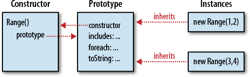

# Chapter 09: 类和模块

## 概述

如果你对 Java 和 C++这种强类型的面向对象编程比较熟悉，你会发现 JavaScript 中的类和 Java 以及 C++中的类有很大不同。尽管在写法上类似，而且在 JavaScript 中也能“模拟”出很多经典的类的特性，但是最好要理解 JavaScript 中的类和基于原型的继承机制，以及和传统的 Java(包括类似 Java 的语言)的类和基于类的继承机制的不同之处。

定义类是模块开发和重用代码的有效方式之一。

## 9.1 类和原型

在 JavaScript 中，一个类的所有实例对象都从同一个原型对象继承属性。因此，原型对象是类的核心特征。在例 6-1 中定义了 inherit()函数，整个函数返回一个新创建的对象，这个对象继承自某个原型对象。如果定义一个原型对象，然后使用 inherit()创建继承自它的对象，我们就定义了一个 JavaScript 类。通常来说，类的实例还需要进一步初始化，常规做法是定义一个函数来创建并初始化这个新的实例对象。正如例 9-1 所示：它给一个表示值的范围的类定义了原型对象，还定义了一个工厂函数来创建并初始化这个类的新实例对象。

例 9-1：一个简单的 JavaScript 类

```javascript
// range.js: 表示值的范围的类。

// 这是一个工厂方法，返回一个新的Range对象。
function range(from, to) {
  // 使用inherit()方法来创建对象，这个对象继承自下面定义的原型对象。
  // 原型对象存储在函数的一个属性中，它定义了所有“Range对象”所共享的方法（行为）。
  var r = inherit(range.methods);

  // 存储这个新的Range对象的开始点和结束点（状态）
  // 这两个属性是非继承属性，对每个对象来说，它们都是唯一的
  r.from = from;
  r.to = to;

  // 最后返回这个新创建的对象
  return r;
}

// 这个原型对象定义的方法可以被所有的Range对象继承。
range.methods = {
  // 如果x在范围中返回true，否则返回false
  // 这个方法可适用于数字，文本和日期
  includes: function(x) {
    return this.from <= x && x <= this.to;
  },

  // 依次对范围内的每个整数调用函数f
  // 仅适用于数字范围
  foreach: function(f) {
    var x = Math.ceil(this.from);
    for (; x <= this.to; x++) {
      f(x);
    }
  },

  // 返回表示这个范围的字符串
  toString: function() {
    return "(" + this.from + "..." + this.to + ")";
  }
};

// 下面是一些使用Range对象的例子
var r = range(1, 3); // 创建一个Range对象
r.includes(2); // => true: 2 is in the range
r.foreach(console.log); // 打印1 2 3
console.log(r); // (1...3)
```

上例的代码定义了一个工厂函数 range()来创建新的 Range 对象，其中有一些值得注意的事情。首先，我们使用了 range()函数的 range.methods 属性来便捷地存储定义类的原型对象。把原型对象放在这里并没有什么特别的，也不是什么习惯用法。其次，range()函数在每一个 Range 对象上定义了 from 和 to 属性。这些属性表示每个对象自身独一无二的状态（起始点和结束点），它们是非共享的，也是非继承的。最后，在 range.methods 中定义的共享并可继承的方法都使用了 from 和 to 属性。为了引用它们，我们使用了 this 关键字来指代调用这个方法的对象。我们经常见到，this 的这种用法是类方法的一个基本特征。

## 9.2 类和构造函数

例 9-1 展示了一种定义 JavaScript 类的方法。但是，这不是惯用的方式，因为它没有定义构造函数(constructor)。构造函数是为初始化新创建的对象而设计的函数。使用\$8.2.3 节中描述的关键字 new 来调用构造函数。使用 new 的构造函数调用时会自动创建新对象，因此构造函数本身只需要初始化该新对象的状态。**构造函数调用的关键特性是构造函数的 prototype 属性将被用作新对象的原型**。这意味着从同一个构造函数创建的所有对象都继承自同一个原型对象，并且它们都是同一个类的成员。例 9-2 修改了例 9-1 中的范围类，使用构造函数代替了工厂函数：

例 9-2：使用构造函数的范围类

```javascript
// range2.js: 另一个表示范围值的类

// 这是一个初始化新Range对象的构造函数
// 注意它不创建也不返回这个对象，仅仅是初始化
function Range(from, to) {
  // 存储这个新的Range对象的开始点和结束点（状态）
  // 这两个属性是非继承属性，对每个对象来说，它们都是唯一的
  this.from = from;
  this.to = to;
}

// 所有的Range对象都继承自该对象
// 注意这里的属性名字必须是"prototype"才能生效。
Range.prototype = {
  // 如果x在范围中返回true，否则返回false
  // 这个方法可适用于数字，文本和日期
  includes: function(x) {
    return this.from <= x && x <= this.to;
  },
  // 依次对范围内的每个整数调用函数f
  // 仅适用于数字范围
  foreach: function(f) {
    var x = Math.ceil(this.from);
    for (; x <= this.to; x++) {
      f(x);
    }
  },
  // 返回表示这个范围的字符串
  toString: function() {
    return "(" + this.from + "..." + this.to + ")";
  }
};

// 下面是一些使用Range对象的例子
var r = new Range(1, 3); // 创建一个Range对象
r.includes(2); // => true: 2 is in the range
r.foreach(console.log); // 打印1 2 3
console.log(r); // 打印(1...3)
```

值得仔细比较例 9-1 和例 9-2，并注意这两种定义类的技术之间的差异。

首先，我们在将它转化为构造函数时把 range()工厂函数重命名为 Range()。这是一种很常见的编码约定：构造函数在某种意义上定义了类，而类的名称以大写字母开头。常规函数和方法的名称以小写字母开头。

其次，调用 Range()构造函数时使用了 new 关键字，而调用 range()工厂函数时则不需要 new 关键字。例 9-1 使用了常规函数调用来创建新的对象(\$8.2.1)，而例 9-2 则使用了构造函数调用(\$8.2.3)。因为使用 new 调用 Range()构造函数，所以它不必调用 inherit()方法或采取任何操作来创建新对象。这个新对象会在调用构造函数之前自动创建，并且可以通过 this 值来访问。Range()构造函数只需要初始化它。构造函数甚至不必返回新创建的对象。构造函数调用自动创建一个新对象，将构造函数作为该对象的方法调用，并返回这个新对象。构造函数调用和常规函数调用是如此的不同，这也是我们在构造函数命名时以大写字母开头的另一个原因。构造函数被编写为使用 new 关键字作为构造函数调用，如果被当作常规函数调用，它们通常将无法正常工作。保持构造函数和常规函数不同的命名约定有助于程序员知道何时使用 new。

例 9-1 和例 9-2 之间的另一个关键区别是原型对象的命名方式。在第一个例子中，原型对象是 range.methods。这种命名很方便，语义化也很好，但是过于随意。在第二个例子中，原型对象是 Range.prototype，这是一个强制的命名。调用 Range()构造函数时，会自动使用 Range.prototype 作为新 Range 对象的原型。

最后，还要注意例 9-1 和例 9-2 的共通之处：两者类方法的定义和调用方式都是相同的。

### 9.2.1 构造函数和类的标识(Class Identity)

正如我们所见，原型对象是一个类最根本的标识：当且仅当两个对象继承自同一个原型对象时，它们才是同一个类的实例。初始化新对象状态的构造函数不能作为类的标识：两个构造函数的 prototype 属性可能指向同一个原型对象。那么这两个构造函数都可以用于创建同一个类的实例。

即使构造函数不像原型那样基本，构造函数也可以作为类的“门面”(public face)。最明显的就是，构造函数的名称通常被用作类的名称。比如，我们说 Range()构造函数创建 Range 对象。然而，更基本的是，构造函数和 _instanceof_ 运算符一起使用，可以用来检测一个对象是否属于某个类。假设我们有一个对象 r，想知道它是否是 Range 对象，我们可以这样写：

```javascript
// 如果r继承自Range.prototype，返回true
r instanceof Range;
```

实际上 instanceof 运算符并不会检查 r 是否由 Range 构造函数初始化。它检查它是否继承自 Range.prototype 对象。然而，instanceof 的语法强化了“构造函数作为类的公共标识的用途”的印象。我们将在本章后续再次见到 instanceof 运算符。

### 9.2.2 constructor 属性

在例 9-2 中，我们将 Range.prototype 设置为包含我们类的方法的新对象。尽量将这些方法表达为一个对象直接量(object literal)的属性很方便，但实际上并不需要创建新对象。任何 JavaScript 函数都可以用作构造函数，而构造函数调用需要一个 prototype 属性。因此，每个 JavaScript 函数（ES5 中 Function.bind()方法返回的函数除外）都自动拥有一个 prototype 属性。这个属性的值是一个对象，这个对象只有一个不可枚举的 constructor 属性（\_\_proto\_\_属性除外）。而 constructor 属性的值就是这个函数对象：

```javascript
var F = function() {}; // 函数对象
var p = F.prototype; // F关联的原型对象
var c = p.constructor; // p关联的函数
// 对任意函数都成立：F.prototype.constructor == F
c === F; // => true
```

从上面代码中，可以看到预定义的原型对象及其 constructor 属性。这意味着每个对象一般都会继承一个 constructor 属性，这个属性指向它的构造函数。由于构造函数充当类的公共标识，因此这个 constructor 属性提供了对象的类：

```javascript
var o = new F(); // 创建一个F类的对象o
o.constructor === F; // => true: constructor属性指定类
```

图 9-1 展示了构造函数，其原型对象，从原型到构造函数的逆向引用(back reference)以及使用构造函数创建实例之间的关系。

  
_图 9-1.构造函数，其原型和实例_

请注意，图 9-1 使用了我们的 Range()构造函数来作为例子。但是，实际上，例 9-2 中的 Range 类会使用自己的对象覆盖预定义的 Range.prototype 对象。所以 Range 类的实例，正如定义的一样，没有 constructor 属性。我们可以通过向原型对象显式添加一个 constructor 属性来解决这个问题：

```javascript
Range.prototype = {
  constructor: Range, // 显式设置逆向引用的构造函数
  includes: function(x) {
    return this.from <= x && x <= this.to;
  },
  foreach: function(f) {
    var x = Math.ceil(this.from);
    for (; x <= this.to; x++) {
      f(x);
    }
  },
  toString: function() {
    return "(" + this.from + "..." + this.to + ")";
  }
};
```

另一种常见技术是使用预定义的原型对象及其 constructor 属性，然后一个一个地向其添加方法：

```javascript
// 扩展预定义的Range.prototype对象，
// 使得我们不会覆盖自动创建的Range.prototype.constructor属性
Range.prototype.includes = function(x) {
  return this.from <= x && x <= this.to;
};
Range.prototype.foreach = function(f) {
  var x = Math.ceil(this.from);
  for (; x <= this.to; x++) f(x);
};
Range.prototype.toString = function() {
  return "(" + this.from + "..." + this.to + ")";
};
```

## 9.3 JavaScript 中 Java 风格的类

如果你使用过 Java 或类似的强类型面向对象编程语言，你可能会习惯性地思考以下 4 种类成员：

1. 实例变量  
   这些是每个实例的属性或变量，用来保存单个对象的状态。
1. 实例方法  
   这些是由单个实例调用的方法，它们被类的所有实例所共享（类的所有实例对象都可以调用类的实例方法）。
1. 类变量  
   这些是与类（而不是类的实例）关联的属性或变量，无法通过类的实例访问这些变量。
1. 类方法  
   这些是与类（而不是类的实例）关联的方法，无法通过类的实例调用这些方法。

JavaScript 与 Java 有一点不同：它的函数也是值，所以方法和变量之间并没有很严格的区别。如果一个属性的值是函数，则该属性定义了一个方法，否则，它就只是一个普通的变量。尽管存在这种差异，我们仍然可以在 JavaScript 中模拟 Java 的 4 种类成员。在 JavaScript 种，任何类的定义都涉及 3 个不同的对象（参见图 9-1），这 3 个对象的属性就像不同类的类成员一样：

- 构造函数对象  
  我们看到，构造函数（对象）为 JavaScript 类定义了一个名字。任何添加到这个构造函数对象的属性都是类变量或类方法（取决于属性值是否为函数）。
- 原型对象  
  此对象的属性会被类的所有实例所继承，其值为函数的属性的行为类似于类的实例方法（可以在类的实例中直接调用该方法）。
- 实例对象  
  类的每个实例本身都是一个对象，直接在实例上定义的属性不会被任何其他实例所共享。在实例上定义的非函数属性的行为和类的实例变量一样。

我们可以将 JavaScript 中的类定义过程简化为一个三步算法：

1. 编写一个构造函数，为新对象设置实例属性
1. 在构造函数的原型对象上定义实例方法
1. 在构造函数中定义类变量和类属性

我们甚至可以将此算法实现为一个简单的 defineClass()方法（用到了例 6-2 中定义，并在例 8-3 中完善的 extend()方法）：

```javascript
/**
 * 一个定义简单类的简单函数
 * @param {*} constructor 定义实例属性的函数
 * @param {*} methods 实例方法：拷贝到原型对象
 * @param {*} statics 类属性： 拷贝到构造函数
 */
function defineClass(constructor, methods, statics) {
  if (methods) extend(constructor.prototype, methods);
  if (statics) extend(constructor, statics);
  return constructor;
}

// 这是我们Range类的一个简单变体
var SimpleRange = defineClass(
  function(f, t) {
    this.f = f;
    this.t = t;
  },
  {
    includes: function(x) {
      return this.f <= x && x <= this.to;
    },
    toString: function() {
      return this.f + "..." + this.to;
    }
  },
  {
    upto: function(t) {
      return new SimpleRange(0, t);
    }
  }
);
```

例 9-3 是一个更长的类定义。它创建了一个表示复数的类，并演示了如何用 JavaScript 模拟 Java 风格的类成员。它不依赖于上面的 defineClass()函数，而是“手动”完成。

例 9-3. Complex.js: 一个复数类

```javascript
/**
 * Complex.js:
 * 这个文件定义一个Complex类来表示复数。
 * 回想一下：一个复数是一个实数和一个虚数的和，而虚数i是-1的平方根
 */

/**
 * 这个构造函数为其创建的每个实例对象定义了实例变量r和i。
 * 这两个实例变量保存了复数的实部和虚部：它们是对象的状态。
 */
function Complex(real, imaginary) {
  if (isNaN(real) || isNaN(imaginary)) throw new TypeError();
  this.r = real; // 实部
  this.i = imaginary; // 虚部
}

/**
 * 类的实例方法被定义为原型对象的属性（值为函数）。
 * 此处定义的方法可以被所有的实例对象继承，这些方法提供类的共享行为。
 * 注意JavaScript的实例方法必须使用this关键字去访问实例变量。
 */

// 当前复数加上另一个复数，并在一个新对象中返回它们的和
Complex.prototype.add = function(that) {
  return new Complex(this.r + that.r, this.i + that.i);
};

// 当前复数乘以另一个复数，返回它们的乘积
Complex.prototype.mul = function(that) {
  var r = this.r * that.r - this.i * that.i;
  var i = this.r * that.i + this.i * that.r;
  return new Complex(r, i);
};

// 返回复数的模，它定义为原点(0, 0)到复平面的距离
Complex.prototype.mag = function() {
  return Math.sqrt(this.r * this.r + this.i * this.i);
};

// 复数取负
Complex.prototype.neg = function() {
  return new Complex(-this.r, -this.i);
};

// 复数转化为字符串
Complex.prototype.toString = function() {
  return "{" + this.r + "," + this.i + "}";
};

// 测试当前复数和另一个复数是否有相同的值。
Complex.prototype.equals = function(that) {
  return (
    that != null &&
    that.constructor === Complex &&
    this.r === that.r &&
    this.i === that.i
  );
};

/**
 * 类变量（如常量）和类方法被定义为构造函数的属性。
 * 注意类方法通常不使用this关键字：它们仅对其实参进行处理。
 */

// 这里有一些类变量来保存一些预定义的常用实数。
// 它们的名字是全大写的，表明它们是常量。
// （在ES5中，我们实际上可以通过属性描述符，让这些属性只读）
Complex.ZERO = new Complex(0, 0);
Complex.ONE = new Complex(1, 0);
Complex.I = new Complex(0, 1);

// 这个类方法按特定格式（与toString()实例方法返回的字符串格式相同）去解析字符串参数，
// 返回一个新的复数对象，或抛出TypeError。
Complex.parse = function(s) {
  try {
    var m = Complex._format.exec(s);
    return new Complex(parseFloat(m[1]), parseFloat(m[2]));
  } catch (x) {
    throw new TypeError("Can't parse '" + s + "' as a complex number.");
  }
};

// 一个在上面Complex.parse()方法中用到的“私有”类变量。
// 变量名前面的下划线表明它旨在供内部使用，不应被视为这个类公共API的一部分。
Complex._format = /^\{([^,]+),([^}]+)\}$/;
```

通过例 9-3 定义的复数类，我们可以使用构造函数，实例变量，实例方法，类变量和类方法。代码如下：

```javascript
// 使用构造函数创建一个新的对象
var c = new Complex(2, 3);
// 使用c的实例变量
var d = new Complex(c.i, c.r);
// 使用实例方法
c.add(d).toString(); // => {5,5}

// 一个更复杂的表达式，使用了类方法和类变量
Complex.parse(c.toString()) // 把c转换成字符串，再解析成对象
  .add(c.neg()) // 加上c的相反数
  .equals(Complex.ZERO); // =>true: 始终为0
```

虽然 JavaScript 类可以模拟 Java 风格的类成员，但还有一些重要的 Java 功能是 JavaScript 无法支持的。首先，Java 类的实例方法中，实例变量可以直接当作局部变量使用——无须 this 做前缀。JavaScript 不能这么做，但是你可以使用 with 语句实现类似的效果（但不建议这么做）：

```javascript
Complex.prototype.toString = function() {
  with (this) {
    return "{" + r + "," + i + "}";
  }
};
```

Java 允许将变量声明为 final 以表明它们是常量，并且它允许将字段和方法声明为 private，以指定它们是实现类私有的，并且不应该对该类的用户（类外部的调用者）可见。JavaScript 没有这些关键字，例 9-3 使用命名约定(typographical conventions)来给出提示：一些属性（名称全用大写字母表示）不应该被修改，另一些属性（名称以下划线开头）不应该在类的外部使用。我们将在本章后面回到这两个主题：私有变量可以使用闭包的局部变量模拟(\$9.6.6)、ES5 中可以使用常量属性(\$9.8.2)。

## 9.4 类的扩展(Augmenting Classes)

JavaScript 基于原型的继承机制是动态的：即使原型在创建对象后发生更改，对象也能从其原型继承属性（包括修改后的属性）。这意味着我们可以通过给原型添加新方法来扩充 JavaScript 类。下述代码给例 9-3 中的 Complex 类添加了一个求共轭复数(complex conjugate)的方法：

```javascript
// 续：例9-3：

// 返回当前复数的共轭复数
Complex.prototype.conj = function() {
  return new Complex(this.r, -this.i);
};

c.conj(); // => {2,-3}
```

内置 JavaScript 类的原型对象也是像这样“开放”的，这意味着我们可以给 numbers，strings，arrays，functions 等类添加新方法。其实我们已经这样做过了：在例 8-5 中，我们给 ES3 的 function 类添加了一个 bind()方法。

```javascript
if (!Function.prototype.bind) {
  Function.prototype.bind = function(o /* args */) {
    // ...
  };
}
```

这里是一些其他例子：

```javascript
// 多次调用函数f，传入需要迭代的次数
// 比如，打印3次"hello"
// var n = 3;
// n.times(function(n) {console.log(n + " hello")})
Number.prototype.times = function(f, context) {
  var n = Number(this);
  for (var i = 0; i < n; i++) {
    f.call(context, i);
  }
};

// 定义ES5中的String.trim()方法（如果它不存在）
// 这个方法返回去掉首尾空白的字符串
String.prototype.trim =
  String.prototype.trim ||
  function() {
    if (!this) return this;
    return this.replace(/^\s+|\s+$/g, "");
  };

// 返回函数的名称。如果它有一个name属性（非标准），返回其值。
// 否则，把函数转化为字符串，并从中提取函数名。
// 对于未命名的函数（如这个函数本身），返回空白字符串。
Function.prototype.getName = function() {
  return this.name || this.toString.match(/function\s*([^(]*)\(/)[1];
};
```

给 Object.prototype 添加方法，让它们对所有的对象可见，也是可行的。但是不推荐这么做，因为 ES5 之前，没有办法让这些附加的方法不可枚举，如果向 Object.prototype 添加属性，那么所有的 for/in 循环都会呈现这些属性。在\$9.8.1 中，我们会看到一个使用 ES5 的 Object.defineProperty()方法来安全扩展 Object.prototype 的例子。

是否可以通过这种方式扩展由宿主环境(如 web 浏览器)定义的类，需要看其具体的实现方式。比如，在很多 web 浏览器中，你可以向 HTMLElement.prototype 添加方法，这些方法会被表示当前文档中 HTML tags 的对象所继承。但是，这在当前版本的 IE 浏览器中无效，这严重限制了此技术在客户端编程中的作用。

## 9.5 类和类型(Classes and Types)

回想一下，我们在第 3 章定义了一些类型：null、undefined、boolean、number、string、 function 和 object。通过 typeof 运算符(\$4.13.2)可以区分这些类型。但是，通常将每个类视为自己的类型，并且能够根据类来区分对象是有用的。核心 JavaScript 的内置对象（和通常客户端 JavaScript 的宿主对象）可以使用类似于例 6-4 的 classof() 函数的代码在 _class_ 属性(\$6.8.2)的基础上进行区分。但是当我们用本章介绍的方法定义自己的类时，其实例对象 _class_ 属性的值通常是"Object"，所以 classof() 函数在这里没有用。

接下来的小节解释了确定任意对象所属类的 3 种技术：instanceof 运算符、constructor 属性和构造函数的名称。然而，这些技术都不是完全令人满意的。本节的最后讨论了**鸭式辨型**(duck-typing)，这是一种编程哲学，专注于一个对象可以做什么（它有什么方法）而不是它的类是什么。

### 9.5.1 instanceof 运算符

_instanceof_ 运算符在\$4.9.4 中有详细描述，左操作数是待测试其类的对象，而右操作数是一个命名类的构造函数。如果 o 继承自 c.prototype，表达式 _o instanceof c_ 为 true。继承不一定是直接的，比如 o 继承自一个对象，而这个对象又继承自 c.prototype，那么表达式的值仍然为 true。

如本章前面所述，构造函数充当类的公共标识(public identity)，但原型对象是其根本标识(fundamental identity)。尽管在 instanceof 中使用了构造函数，但是这个运算符实际上是在测试一个对象从何处继承，而非测试用于创建它的构造函数。

如果你想测试某个特定的原型对象是否在一个对象的原型链上，并且不想使用构造函数作为中间量，你可以使用 [isPrototypeOf()][object​.prototype​.isprototypeof] 方法。比如，我们可以通过以下代码测试一个对象 r 是不是 range 类（例 9-1 中定义）的一个成员：

[object​.prototype​.isprototypeof]: https://developer.mozilla.org/en-US/docs/Web/JavaScript/Reference/Global_Objects/Object/isPrototypeOf

```javascript
range.methods.isPrototypeOf(r); // range.methods是原型对象
```

instanceof 运算符和 isPrototypeOf()方法的一个缺点是它们不允许我们查询对象的类，只是针对我们指定的类测试对象。在客户端 JavaScript 中，当一个 web 应用程序使用多个 window 或 frame 的时候，会出现一个更严重的问题。每个 window 或 frame 都有一个独立的执行上下文(execution context)，拥有各自独立的全局对象和构造函数集。在两个不同 frames 中创建的两个数组继承自两个不同原型的对象（尽管创建原型的是同一段代码，但是在两个环境中分别执行了 1 次，生成的是 2 个不同的原型对象），因此在一个 frame 中创建的数组不是另一个 frame 的 Array()构造函数的实例（instanceof 为 false）。

### 9.5.2 constructor 属性

识别对象的类的另一种方法是简单地使用 _constructor_ 属性。由于构造函数是类的“门面”(public face)，这也是一种很直接的方法。比如：

```javascript
function typeAndValue(x) {
  if (x == null) return ""; // null和undefined没有构造函数
  switch (x.constructor) {
    case Number: // 适用于原型类型
      return "Number: " + x;
    case String:
      return "String: " + x;
    case Date: // 内置类型
      return "Date: " + x;
    case RegExp:
      return "RegExp: " + x;
    case Complex: // 用户定义类型
      return "Complex: " + x;
  }
}
```

请注意上面代码中 case 关键字后面的表达式都是函数。如果我们使用 typeof 运算符或提取对象的 class 属性，那么它们将是字符串。

这种使用 constructor 属性的技术会遇到和 instanceof 一样的问题。当多个执行上下文（例如浏览器窗口中的多个 frame）共享值时，它并不总是有效。这种情况下，每个 frame 都有自己的构造函数集，一个 frame 中 Array 构造函数不同于另一个 frame 中的 Array 构造函数。

此外，JavaScript 并不要求每个对象都有 constructor 属性：这是基于为函数创建的默认原型对象的约定，但很容易意外或故意省略原型上的 constructor 属性。例如，本章的前两个类就是这样定义的（在例 9-1 和例 9-2 中），它们的实例并没有 constructor 属性。

### 9.5.3 构造函数名称

使用 instanceof 运算符或 constructor 属性来识别对象的类的主要问题都发生在有多个执行上下文的环境中。这种环境会导致构造函数出现多个副本，这些函数可能完全相同，但它们是不同的对象，因此彼此不相等。

一个可行的办法是使用构造函数的名称（而不是函数本身）作为类的标识符。在一个 window 中 Array 构造函数与另一个 window 中的 Array 构造函数是不同的，但是它们的名称是相同的。在一些 JavaScript 实现中，可以通过函数对象的 name 属性(非标准)来获取函数名称。对于那些没有 name 属性的实现，我们可以把函数转化为字符串并从中提取名称。（在\$9.4 中给 Function 类添加的 getName()方法就是在做这件事。）

例 9-4 定义了一个 type()函数，以字符串返回对象的类型。它使用 typeof 运算符处理原始值和函数。对于对象，它返回 _class_ 属性的值或构造函数的名称。type 函数使用了例 6-4 中的 classof()函数和\$9.4 中的 Function.getName()方法。为了简单起见，这里包含了该函数和方法的代码。

例 9-4. type()函数用来识别一个值的类型

```javascript
/**
 * 以字符串返回o的类型。
 *  - 如果o是null，返回"null"，如果o是NaN，返回"nan"
 *  - 如果typeof不是返回"object"，则直接返回这个值
 *  - （注意有些JS实现把RegExp标识为函数）
 *  - 如果classof不是返回"Object"，则直接返回这个值
 *  - 如果o有构造函数，并且构造函数有名称，则返回这个名称
 *  - 否则，返回“Object”
 */
function type(o) {
  var t, c, n; // type, class, name

  // 特殊处理null值
  if (o === null) return "null";

  // 特殊处理NaN值： NaN是唯一不等于自身的值。
  if (o !== o) return "nan";

  // 原始值和函数
  if ((t = typeof o) !== "object") return t;

  // 大部分内置对象
  if ((c = classof(o)) !== "Object") return c;

  // 返回对象的构造函数名称（如果存在）
  if (
    o.constructor &&
    typeof o.constructor === "function" &&
    (n = o.constructor.getName())
  )
    return n;

  // 无法确定更具体的类型
  return "Object";
}

// 返回对象的类
function classof(o) {
  return Object.prototype.toString.call(o).slice(8, -1);
}

// 返回函数的名称（可能为""）或null(非函数)
Function.prototype.getName = function() {
  if ("name" in this) return this.name;
  return (this.name = this.toString().match(/function\s*([^(]*)\(/)[1]);
};
```

使用构造函数名称来识别对象的类也有一个和使用 constructor 属性一样的问题：不是所有的对象都有 constructor 属性。同样，也不是所有的函数都有一个名称(name)。如果我们使用未命名的函数定义表达式来定义一个构造函数，getName()方法会返回一个空的字符串：

```javascript
// 没有名称的构造函数
var Complex = function(x, y) {
  this.r = x;
  this.i = y;
};

// 有名称的构造函数
var Range = function Range(f, t) {
  this.from = f;
  this.to = t;
};
```

### 9.5.4 鸭式辨型(Duck-Typing)

上面几种识别对象的类的技术都不是完全没问题的，至少在客户端 JavaScript 中是这样。另一个种办法是回避这个问题：与其问：“这个对象的类是什么？”，不如问：“这个对象能够做什么？”。这种编程方法在 Python 和 Ruby 等语言中很常见，并且被称为“鸭式辨型”(Duck-Typing)。这种叫法通常归功于诗人 James Whitcomb Riley：

> When I see a bird that walks like a duck and swims like a duck and quacks like a duck, I call that bird a duck.
>
> 当我看见一只像鸭子一样散步，像鸭子一样游泳，像鸭子一样嘎嘎叫的鸟儿时，我称这只鸟为鸭子。

对于 JavaScript 程序员来说，这句格言可以理解为：“如果一个对象可以像鸭子一样散步，游泳和嘎嘎叫，即使它不继承 Duck 类的原型，我们也可以把它当作鸭子对象”。

就拿例 9-2 中的 Range 类来说，这个类用来处理数值范围。注意 Range()构造函数并没有检查它的参数来确保它们都是数值，然而它却使用了 > 运算符，所以它假定它们是具有可比性的。同样，includes()方法使用 <= 运算符，但不对 range 对象的端点做任何其他假设。由于这个类没有强制特定的类型，因此其 includes()方法适用于可与关系运算符进行比较的任何类型的端点：

```javascript
var lowercase = new Range("a", "z");
var thisYear = new Range(new Date(2009, 0, 1), new Date(2010, 0, 1));
```

Range 类的 foreach()方法也没有明确测试范围端点的类型，但它使用了 Math.ceil()方法和++运算符意味着它仅仅适用于数值端点。

另一个例子，回想一下我们在\$7.11 中讨论的类数组对象。在很多情况下，我们无须知道一个对象是否真的是数组类的实例，只需知道它有一个非负整数的 length 属性就够了。我们可以说，整型值长度的存在就是数组如何“散步”（对应上面的鸭子散步），并且任何可以以这种方式“散步”的对象都可以（在很多情况下）被视为数组。

然而，要记住，真数组的 length 属性具有特殊的行为：当添加新元素后，length 会自动更新，当把 length 设置为更小的值，数组会自动被截断。我可以说这是数组如何“游泳”和“嘎嘎叫”。如果你在编写的代码需要“游泳”和“嘎嘎叫”，你就不能使用只会“散步”的对象。

上面介绍的鸭式辨型涉及对象对 "<" 运算符的响应以及 length 属性的特殊行为。然而，更典型的是，当我们我们讨论鸭式辨型时，我们讨论的是测试一个对象是否实现了一个或多个方法。强类型的 triathlon()函数（铁人三项）可能要求其参数为 TriAthlete 对象。鸭式辨型替代方法可以设计为接受具有 walk()，swim()和 bike()方法的任意对象。我们可以更谨慎地重新设计 Range 类，以便不使用 < 和 ++ 运算符，而是使用其端点对象的 compareTo()方法和 succ()方法(successor)。

鸭式辨型的一种方法是放任自流：我们只是假设我们的输入对象实现了必要的方法并且不做任何检查。如果假设无效，当我们代码尝试调用不存在的方法时，将发生错误。另一种方法是检查输入对象。但是，不是检查它们的类，而是检查它们是否实现了具有相应名称的方法。这允许我们更早地拒绝错误输入，并且可以提供更多错误信息。

例 9-5 实现了一个鸭式辨型时有用的 quacks()函数，它测试一个对象 o（由第一个参数指定）是否实现了由剩余参数指定的方法。对每个剩余参数而言，如果其是字符串，就检查 o 中是否有同名方法；如果参数是对象，就检查 o 是否实现了与该对象的方法同名的所有方法；如果参数是函数，则假定它是构造函数，并检查 o 是否实现了与该函数的原型具有相同名称的所有方法。

例 9-5. 用于鸭式辨型检查的函数

```javascript
// 如果对象o实现了剩余参数指定的方法，返回true。
function quacks(o /*, ... */) {
  for (var i = 1; i < arguments.length; i++) {
    // 遍历剩余参数
    var arg = arguments[i];

    switch (
      typeof arg // 如果arg是：
    ) {
      case "string": // 字符串： 检查o是否有同名方法
        if (typeof o[arg] !== "fucntion") {
          return false;
        }
        continue;
      case "function": // 函数：使用其原型
        arg = arg.prototype;
      // 通过到下个case继续处理
      case "object": // 对象：检查方法匹配
        for (var m in arg) {
          // 逐一检查对象的属性
          if (typeof arg[m] !== "function") continue; // 忽略非方法
          if (typeof o[m] !== "function") return false;
        }
    }
  }

  // 执行到这里，o 通过了所有检查
  return true;
}
```

关于这个 quacks()函数，要记住几个重要的事情。首先，它仅检验对象是否拥有一个或多个具有指定名称并且值为函数的属性。这些属性的存在并不能告诉我们函数做了什么、或者它们期望的参数个数和类型。然而，这却是鸭式辨型的本质特征。如果你使用鸭式辨型而不是更强版本的类型检查来定义 API，那么你创建的是更灵活的 API，但也托付 API 的用户（使用者）负责正确使用 API。关于 quacks()函数的第二个要求是它不适用于内置类。比如，你不能使用 quacks(o, Array)来测试 o 是否拥有与 Array 所有方法同名的方法。这是因为内置类的方法是不可枚举的，在 quacks()方法的 for/in 循环中看不到它们。（请注意，这个问题可以在 ES5 中使用 Object.getOwnPropertyNames()来解决。）

## 9.6 JavaScript 中的面向对象技术

到目前为止，在本章中我们已经介绍了 JavaScript 中类的体系结构的基础知识：原型对象的重要性，它和构造函数的联系，instanceof 运算符如何工作等等。在本节中，我们将使用 JavaScript 类进行编程，并展示一些实用（但不是基础）的技术。我们从两个有意思的示例类开始，并把它作为后续讨论的起点。

### 9.6.1 例：一个 Set 类

集合(set)是一种数据结构，表示无序且不重复的值的集合。其基本操作是向集合添加值和检测一个值是否是集合的成员。（在很多编程语言中）集合通常都已实现，以便这些操作可以快速完成。JavaScript 的对象基本上是属性名称集，其值与每个名称相关联。因此，将对象用作字符串的集合是非常容易的。例 9-6 实现了一个在 JavaScript 中更一般的 Set 类。它的工作原理是把任意 JavaScript 值映射成唯一的字符串，然后将该字符串用作属性名。对象和函数没有简洁可靠的唯一字符串表示形式，因此 Set 必须对存储在集合中的任何对象或函数定义标识属性。

例 9-6. Set.js: 一个值的任意集合

```javascript
function Set() {
  // 构造函数
  this.values = {}; // 保存集合的属性
  this.n = 0; // 集合元素的个数
  this.add.apply(this, arguments); // 添加所有参数到集合中
}

// 添加每个参数到集合中
Set.prototype.add = function() {
  for (var i = 0; i < arguments.length; i++) {
    var val = arguments[i];
    var str = Set._v2s(val);
    if (!this.values.hasOwnProperty(str)) {
      this.values[str] = val;
      this.n++;
    }
  }
  return this; // 支持方法链调用
};

// 从集合中移除由参数指定的元素
Set.prototype.remove = function() {
  for (var i = 0; i < arguments.length; i++) {
    var val = arguments[i];
    var str = Set._v2s(val);
    if (this.values.hasOwnProperty(str)) {
      delete this.values[str];
      this.n--;
    }
  }
  return this; // 链式调用
};

// 如果集合包含value返回true，否则返回false
Set.prototype.contains = function(value) {
  var str = Set._v2s(value);
  return this.values.hasOwnProperty(str);
};

// 返回集合元素个数
Set.prototype.size = function() {
  return this.n;
};

// 为每个集合元素指定context并调用函数f
Set.prototype.foreach = function(f, context) {
  for (var p in this.values) {
    if (this.values.hasOwnProperty(p)) {
      // 忽略继承的属性
      f.call(context, this.values[p]);
    }
  }
};

// 这个内部函数映射任意JavaScript值为唯一字符串
Set._v2s = function(val) {
  switch (val) {
    case undefined: // 特殊原始值获取首字母
      return "u";
    case null:
      return "n";
    case true:
      return "t";
    case false:
      return "f";
    default:
      switch (typeof val) {
        case "number": // 数值加#前缀
          return "#" + val;
        case "string": // 字符串加"前缀
          return '"' + val;
        default:
          // 对象和函数加@前缀
          return "@" + objectId(val);
      }
  }

  // 对任意对象返回一个字符串。这个函数为不同对象返回不同字符串，
  // 并且无论调用多少次，始终为同一个对象返回相同的字符串。
  // 为此它在o上创建了一个属性，在ES5中，这个属性应该是不可枚举和只读的。
  function objectId(o) {
    var prop = "|**objectid**|"; // 私有属性来存储id
    if (!o.hasOwnProperty(prop)) {
      // 如果没有id
      o[prop] = Set._v2s.next++; // 赋下一个可用值
    }
    return o[prop]; // 返回id
  }
};

Set._v2s.next = 100; // 给最开始的对象id赋这个初始值
```

### 9.6.2 例：枚举类型(Enumerated Types)

枚举类型是有限值的集合，其值在定义时列举（或枚举）出来。在 C 及其派生语言中，枚举类型由 enum 关键字定义。在 ES5 中 enum 是保留字（但尚未使用），说明将来某天 JavaScript 可能会原生支持枚举类型。在此之前，例 9-7 展示了如何在 JavaScript 中定义自己的枚举类型。注意它使用了例 6-1 中的 inherit() 方法。

例 9-7 由单个函数 enumeration()组成。然而，它不是构造函数，它并没有定义"enumeration"类。实际上，这是一个工厂函数：每次调用都会创建并返回一个新的类。像这样使用它：

```javascript
// 创建一个Coin类，拥有4个值Coin.Penny, Coin.Nickel等
var Coin = enumeration({
  Penny: 1,
  Nickel: 5,
  Dime: 10,
  Quarter: 25
});
var c = Coin.Dime; // 这个类的实例
c instanceof Coin; // => true，适用instanceof
c.constructor == Coin; // => true，适用constructor
Coin.Quarter + 3 * Coin.Nickel; // => 40：转化为数值(valueOf方法)
Coin.Dime == 10; // => true：转化为数值
Coin.Dime > Coin.Nickel; // => true：适用关系运算符
String(Coin.Dime) + ":" + Coin.Dime; // => "Dime:10":强制转化成字符串
```

这个例子的重点是展示了 JavaScript 类远比 Java 和 C++等语言的静态类更灵活、更动态(dynamic)。

例 9-7. JavaScript 中的枚举类型

```javascript
// 这个函数创建一个新的枚举类型。参数对象指定这个类每个实例的名称和值。
// 返回值是一个标识新类的构造函数。但是，注意这个构造函数抛出一个异常：
// 你不能使用它创建该类型的新实例。
// 返回的构造函数有名值映射的属性、保存值列表的数组和foreach迭代函数。
function enumeration(nameToValues) {
  // 这是将用作返回值的伪构造函数
  var enumeration = function() {
    throw "Can't Instantiate Enumerations";
  };

  var proto = (enumeration.prototype = {
    constructor: enumeration, // 标识类型
    toString: function() {
      return this.name; // 返回名称
    },
    valueOf: function() {
      return this.value; // 返回值
    },
    toJSON: function() {
      return this.name; // 序列化
    }
  });

  enumeration.values = []; // 保存枚举对象的数组

  // 创建新类型的实例
  for (name in nameToValues) {
    // 对每个值：
    var e = inherit(proto); // 创建代表它的对象
    e.name = name; // 添加name
    e.value = nameToValues[name]; // 添加value
    enumeration[name] = e; // 使它称为构造函数的属性
    enumeration.values.push(e); // 把它保存到数组中
  }

  enumeration.foreach = function(f, c) {
    for (var i = 0; i < this.values.length; i++) {
      f.call(c, this.values[i]);
    }
  };

  // 返回标识新类型的构造函数
  return enumeration;
}
```

枚举类型的"hello world"是使用枚举类型来表示卡牌组中的套牌（例 9-8）。它使用了 enumeration()函数，并定义了表示卡牌和卡牌组的类。

例 9-8. 用枚举类型表示卡牌

```javascript
/**
 * 表示卡牌的类
 * @param {*} suit 花色
 * @param {*} rank 大小
 */
function Card(suit, rank) {
  this.suit = suit;
  this.rank = rank;
}

// 这两个枚举类型定义卡牌的花色和大小
Card.Suit = enumeration({ Clubs: 1, Diamonds: 2, Hearts: 3, Spades: 4 });
Card.Rank = enumeration({
  Two: 2,
  Three: 3,
  Four: 4,
  Five: 5,
  Six: 6,
  Seven: 7,
  Eight: 8,
  Nine: 9,
  Ten: 10,
  Jack: 11,
  Queen: 12,
  King: 13,
  Ace: 14
});

// 卡牌的文本表示
Card.prototype.toString = function() {
  return this.rank.toString() + " of " + this.suit.toString();
};
// 按扑克牌的方式，比较两张的大小
Card.prototype.compareTo = function(that) {
  if (this.rank < that.rank) return -1;
  if (this.rank > that.rank) return 1;
  return 0;
};

// 按扑克牌的方式排序
Card.orderByBank = function(a, b) {
  return a.compareTo(b);
};

// 按桥牌的方式排序
Card.orderBySuit = function(a, b) {
  if (a.suit < b.suit) return -1;
  if (a.suit > b.suit) return 1;
  if (a.rank < b.rank) return -1;
  if (a.rank > b.rank) return 1;
  return 0;
};

// 定义一个类表示一副标准
function Deck() {
  var cards = (this.cards = []); // 一副卡牌就是一个卡牌数组
  Card.Suit.foreach(function(s) {
    Card.Rank.foreach(function(r) {
      cards.push(new Card(s, r));
    });
  });
}

// 洗牌方法：随机洗牌并返回牌组
Deck.prototype.shuffle = function() {
  var deck = this.cards;
  var len = deck.length;
  for (var i = len - 1; i > 0; i--) {
    var r = Math.floor(Math.random() * (i + 1)); // 随机数
    var temp = deck[i]; // 交换位置
    deck[i] = deck[r];
    deck[r] = temp;
  }
  return this;
};

// 从牌尾抓取n张牌
Deck.prototype.deal = function(n) {
  if (this.cards.length < n) throw "Out of cards";
  return this.cards.splice(this.cards.length - n, n);
};

// 创建一副新牌、洗牌、抓牌并排序
var deck = new Deck().shuffle();
var hand = deck.deal(13).sort(Card.orderBySuit);
```

### 9.6.3 标准转换方法(Standard Conversion Methods)

$3.8.3和$6.10 描述了用于对象类型转换的重要方法，其中有些是在需要转换时由 JavaScript 解释器自动调用的。你无须为每个你写的类实现这些方法，但是它们是很重要的方法，如果你没有为你的类实现它们，应该是有意为之而不是因为疏忽。

首先是最重要的 _toString()_ 方法，该方法的目的是返回表示对象的字符串。如果你使用对象（期望是字符串）作为属性名称，或使用+运算符来连接字符串，JavaScript 自动调用该方法。如果你没有实现这个方法，你的类会从 Object.prototype 继承默认实现并将其转化为无用字符串"[object Object]"。toString()方法可以返回一个人类可读(human-readable)的字符串，适合显示给程序的最终用户。尽管不是必须的，但是为方便 debug 而定义 toString()方法通常也很有用。例 9-2 和例 9-3 中定义的 Range 类和 Complex 类就有 toString()方法，例 9-7 中的枚举类型也是如此。我们将在后面为例 9-6 中的 Set 类定义 toString()方法。

第二个是 _toLocaleString()_ 方法，它和 toString()方法密切相关：它应该把对象转化为本地化(locale-sensitive)的字符串。对象默认继承一个 toLocaleString()方法，该方法只简单调用了其 toString()方法。一些内置类型具有有用的 toLocaleString()方法，可根据语言环境返回相应的字符串。如果你发现自己编写的 toString()方法中还有把其他对象转换成字符串，那么你还应该定义一个 toLocaleString()方法，通过调用这些对象的 toLocaleString()方法来转换。我们在下面的 Set 类中将有此操作。

第三个方法是 _valueOf()_ 方法，它的职责是把对象转化为原始值。当一个对象用在数值环境中时（比如和算术运算符(除了+)、关系运算符一起使用），会自动调用其 valueOf()方法。大多数对象没有合理的原始值表示，也没有定义此方法。然而，例 9-7 中的枚举类型展示了一种 valueOf()方法很重要的场景。

第四个方法是 _toJSON()_ 方法，JSON.stringify()会自动调用该方法。JSON 格式用于数据结构的序列化，可以处理 JavaScript 原始值，数组和普通对象。它没有 class 的概念，序列化一个对象时，它会忽略其原型(prototype)和构造函数(constructor)。如果你为 Range 或 Complex 对象调用 JSON.stringify()方法，它将返回类似 {"from": 1, "to": 3} 或 {"r": 1, "i": -1} 的字符串。如果你把这些字符串传给 JSON.parse()方法，你将得到一个普通对象，这个对象具有适合 Range 和 Complex 对象的属性，但不会继承 Range 和 Complex 的方法。

这种序列化适合 Range 和 Complex 这样的类，但是对于其他类，你可能想编写 toJSON()方法来定义其他的序列化格式。如果对象有 toJSON()方法，JSON.stringify()不再序列化对象而是调用 toJSON()方法并序列化其返回值(原始值或对象)。比如，Date 对象的 toJSON()方法返回表示日期的字符串。例 9-7 中的枚举类型也是如此：它的 toJSON()方法和 toString()方法是相同的。与 Set 最类似的 JSON 数据结构是数组，因此我们下面定义的 toJSON()方法是把 Set 对象转换成一个包含值的数组。

例 9-6 中的 Set 类没有定义上述的任何方法。一个集合没有原始值表达，所以定义 valueOf()方法没有意义，但是这个类应该有 toString()、toLocaleString()和 toJSON()方法。如以下代码所示：（注意使用了例 6-2 中的 extend()方法来为 Set.prototype 添加方法）

```javascript
// 添加以下方法到 Set 的原型中
extend(Set.prototype, {
  // 集合转换为字符换
  toString: function() {
    var s = "{";
    var i = 0;
    this.foreach(function(v) {
      s += (i++ > 0 ? ", " : "") + v;
    });
    return s + "}";
  },
  // 同toString，但是调用其他值的toLocaleString方法
  toLocaleString: function() {
    var s = "{";
    var i = 0;
    this.foreach(function(v) {
      if (i++ > 0) s += ", ";
      // null & undefined
      if (v == null) s += v;
      else s += v.toLocaleString();
    });
    return s + "}";
  },
  // 集合转化为值的数组
  toArray: function() {
    var a = [];
    this.foreach(function(v) {
      a.push(v);
    });
    return a;
  }
});

// 转化为JSON字符串时，把Set当作数组处理
Set.prototype.toJSON = Set.prototype.toArray;
```

### 9.6.4 比较方法(Comparison Methods)

JavaScript 相等运算符通过引用而不是值来比较对象。即是说，给定两个对象的引用，它们会看看这两个引用是否属于同一个对象。它们不会检查两个不同的对象是否具有相同的属性和值。比较两个不同对象是否相等及其相对关系（如 "<" 和 ">" 运算）常常是很有用的。如果你定义一个类并希望能够比较该类的实例，则应定义适当的方法来执行这些比较。

Java 语言使用方法进行对象比较，采用 Java 约定是 JavaScript 中一种常见且有用的做法。为了能测试类的实例是否相等，我们定义一个叫做 equals()的实例方法。它只有一个参数，当这个参数和方法的调用者相等时返回 true。当然，在你的类中"相等"意味着什么由你决定。对于简单的类，你经常可以先简单比较 constructor 属性来确保两个对象属于同种类型，再比较其实例属性来确保它们的值相同。例 9-3 中的 Complex 类就有一个这种类型的 equals()方法，我们可以很容易地为 Range 类编写一个类似的方法：

```javascript
// Range类重写(overwrite)了constructor属性，现在加上它
Range.prototype.constructor = Range;

// Range对象不等于任何非Range对象
// 两个Range对象相等当且仅当它们的端点都相等
Range.prototype.equals = function(that) {
  // null && undefined
  if (that == null) return false;
  // 非range对象
  if (that.constructor !== Range) return false;
  // 如果两个端点相等返回true
  return this.from == that.from && this.to == that.to;
};
```

为我们的 Set 类定义 equals()方法有点棘手。我们不能只简单比较两个 set 对象的 values 属性值，还必须进行更深入的比较：({{ 下例中使用try/catch来跳出foreach循环的技巧值得学习一下 }})

```javascript
Set.prototype.equals = function(that) {
  if (this === that) return true;

  // 如果that不是set对象，它不等于this。
  // 我们使用instanceof运算符，允许Set的子类。
  // 如果我们想要鸭式辨型，可以跳过这个测试。
  // 或者我们也可以加强类型检查，检查this.constructor==that.constructor。
  // 注意instanceof运算符正好排除了null和undefined值。
  if (!(that instanceof Set)) return false;

  // 如果两个set对象的size不同，它们就不相等
  if (this.size() != that.size()) return false;

  // 检查是否this中的每个元素是否都在that对象中
  // 当set对象不相等时，抛出一个异常来跳出foreach循环
  try {
    this.foreach(function(v) {
      if (!that.contains(v)) {
        return false;
      }
    });
    return true; // 所有元素都匹配
  } catch (x) {
    if (x === false) return false; // this中的元素不在that对象中
    throw x; // 其他异常：重新抛出
  }
};
```

有时根据某种顺序来比较对象也很有用。对于一些类，可以说一个实例“小于”或“大于”另一个实例。比如，你可以基于下界(lower bound)对 Range 对象进行排序。枚举类型可以按照名称的字母顺序、或者关联值(假设其为数值)的数值大小排序。另一方面，Set 对象通常并不真正具有自然顺序。

如果你尝试把对象和 JavaScript 关系运算符（比如 < 和 <=）一起使用，JavaScript 首先调用对象的 valueOf()方法，如果这个方法返回原始值，就比较这些值。例 9-7 中由 enumeration()方法返回的枚举类型具有 valueOf()方法，并可以使用关系运算符进行有意义的比较。然而，大多数类并没有 valueOf()方法。要根据你自己选择的、明确定义的顺序来比较这种类型的对象，你可以（再次遵守 Java 约定）定义一个 compareTo()方法。

compareTo()方法应该只接受一个参数，并和方法的调用者作比较。如果 this 对象小于参数对象，该方法返回小于 0 的值。如果 this 对象大于参数对象，该方法返回大于 0 的值。如果两个对象相等，方法返回 0。关于返回值的这些约定很重要，它们允许你将关系运算符、相等运算符（和不等运算符）替换为以下表达式：

| Replace this | With this           |
| :----------- | ------------------- |
| a < b        | a.compareTo(b) < 0  |
| a <= b       | a.compareTo(b) <= 0 |
| a > b        | a.compareTo(b) > 0  |
| a >= b       | a.compareTo(b) >= 0 |
| a == b       | a.compareTo(b) == 0 |
| a != b       | a.compareTo(b) != 0 |

例 9-8 中的 Card 类定义了一个这种 compareTo()方法，我们可以为 Range 类编写一个类似的方法来对 Range 对象排序（基于其下界）：

```javascript
Range.prototype.compareTo = function(that) {
  return this.from - that.from;
};
```

请注意，根据两个 Range 对象的相对顺序，此方法执行的减法正确地返回小于 0，等于 0 或大于 0 的值。由于例 9-8 中的 Card.Rank 枚举具有 valueOf()方法，我们可以在 Card 类的 compareTo()方法中使用这个相同的惯用技巧。

上面的 equals()方法对其参数进行类型检查，如果参数类型错误，则返回 false 表明不相等。compareTo()方法没有任何返回值可以表明“两个值不具备可比性”，所以执行类型检查的 compareTo()方法通常应该在传入错误类型的参数时抛出一个错误。

注意上面我们为 Range 类定义的 compareTo()方法，当两个 Range 对象的下界相同时，它返回 0。这意味着对 compareTo()而言，任何开始点相同的两个 range 对象都是相等的。这种相等的定义与 equals()方法使用的定义不一致，后者需要两个端点都匹配。这种相等概念的不一致性可能是很多 bug 的不良源头，最好是让 equals()和 compareTo()方法一致。这里是一个修订过的 compareTo()方法，它和 equals()方法保持一致，并在遇到不可比的对象时抛出一个错误：

```javascript
// 按下界给Range对象排序，当下界相同时比较上界。
// 如果传入非Range对象，抛出异常。
// 当且仅当this和that相等时，返回0。
Range.prototype.compareTo = function(that) {
  if (!(that instanceof Range)) {
    throw new Error("Can't compare a Range with " + that);
  }
  // 比较下界
  var diff = this.from - that.from;
  // 如果下界相同，比较上界
  if (diff == 0) diff = this.to - that.to;
  return diff;
};
```

为类定义 compareTo()方法的一个原因是便于对该类的实例数组进行排序。[Array.sort()][array​.prototype​.sort] 方法接受一个比较函数作为可选参数，该函数使用与 compareTo()方法相同约定的返回值。给定上面展示的 compareTo()方法，很容易使用以下代码对 Range 对象数组进行排序：

[array​.prototype​.sort]: https://developer.mozilla.org/en-US/docs/Web/JavaScript/Reference/Global_Objects/Array/sort

```javascript
Range.sort(function(a, b) {
  return a.compareTo(b);
});
```

排序非常重要，对于任意你定义了 compareTo()实例方法的类，你应该考虑把这种两个参数的比较函数定义为类方法。比如：

```javascript
Range.byLowerBound = function(a, b) {
  return a.compareTo(b);
};
```

有了这样定义的方法，排序变得更简单：

```javasciprt
ranges.sort(Range.byLowerBound);
```

有的类可能有多种排序方式。例如，Card 类中就定义了按花色排序和按大小排序的方法。

### 9.6.5 借用方法(Borrowing Methods)

JavaScript 中的方法没有什么特别之处：它们只是赋值给对象属性的简单函数，并通过对象来调用。同一个函数可以赋值给两个属性，并当作两个方法。例如，我们在 Set 类中曾这样做过，我们重复使用了 toArray()方法，使其具有两种用途（toArray()和 toJSON()）。

同一个函数甚至可以用作多个类的方法。例如，Array 的大多数内置方法都是通用化定义的，如果你定义一个实例是类数组对象的类，你可以从 Array.prototype 拷贝方法到你的类的原型对象中。如果你从经典的面向对象语言的视角来看 JavaScript，把一个类中方法用作另一个类的方法可以认为是多重继承的一种形式。然而，JavaScript 不是典型的面向对象语言，我更愿意用非正式用语 _“借用”(borrowing_) 来描述这种方法复用。

不是只有数组方法才能被借用：我们可以编写自己的通用方法。例 9-9 定义了通用的 toString()方法和 equals()方法适合简单类（比如我们的 Range、Complex 和 Card 类）使用。如果 Range 类没有 equals()方法，我们可以像这样借用一个通用的 equals()方法：

```javascript
Range.prototype.equals = generic.equals;
```

请注意，generic.equals()方法只做了浅比较，它不适用于其实例的属性引用了具有自己 equals()方法的对象的类。还要注意，此方法包含特例情况的代码，用于处理特殊属性（例 9-6 中添加的 objectId 属性）。

例 9-9. “借用”的通用方法

```javascript
var generic = {
  // 返回包含构造函数名称（如果存在）和
  // 所有非继承也非函数的属性的名值对的字符串。
  toString: function() {
    var s = "[";
    // 如果对象有构造函数，并且构造函数有name属性，
    // 使用该属性值作为返回字符串的一部分。
    // 注意：name是非标准属性，不是全都支持。
    if (this.constructor && this.constructor.name)
      s += this.constructor.name + ": ";

    // 枚举所有非继承、非函数的属性
    var n = 0;
    for (var name in this) {
      // 忽略继承属性
      if (!this.hasOwnProperty(name)) continue;
      var value = this[name];
      // 忽略方法
      if (typeof value === "function") continue;
      if (n++) s += ", ";
      s += name + "=" + value;
    }
    return s + "]";
  },

  // 通过比较构造函数和实例属性，测试this和that是否相等。
  // 仅适用于其实例属性是原始值并可以使用===比较的类
  // 作为特殊情况，忽略Set类添加的特殊属性。
  equals: function(that) {
    if (that == null) return false;
    if (this.constructor !== that.constructor) return false;
    for (var name in this) {
      // 忽略特殊属性
      if (name === "|**objectid**|") continue;
      // 忽略继承属性
      if (!this.hasOwnProperty(name)) continue;
      // 比较值
      if (this[name] != that[name]) return false;
    }
    // 全部属性都匹配，对象是相等的。
    return true;
  }
};
```

### 9.6.6 私有状态

在典型的面向对象语言中，通常有个目标是 _封装(encapsulate)_ 或隐藏对象内的状态，只允许通过对象的方法来访问该状态，但是现在我们在 JavaScript 中却可以直接读取和写入重要的状态变量。为实现这一目标，Java 等语言在类中允许声明 _私有(private)_ 的实例变量，这种变量只能由该类的实例方法访问，而在类的外部其不可见。

我们可以使用从创建实例的构造函数的闭包中捕获的变量（或参数）来近似模拟私有变量。为做到这点，我们在构造函数内部定义函数（这样它们可以访问构造函数的参数和变量）并将这些函数赋值给新创建对象的属性。例 9-10 展示了我们如何创建一个 Range 类的封装版本。新版的实例具有 from 和 to 方法可返回 range 对象的端点（原版的实例直接通过 from 和 to 属性给出端点）。这些 from()和 to()方法是在单个 Range 对象上定义的，而不是从原型继承。其它的 Range 方法和往常一样定义在原型上，但是修改为通过 from()和 to()方法读取端点，而不是直接从属性读取。

例 9-10. 使用弱封装端点的 Range 类

```javascript
function Range(from, to) {
  // 不要把端点存储为对象的属性，
  // 而是定义返回端点值的访问器函数(accessor function)。
  // 这些值存储在闭包中。
  this.from = function() {
    return from;
  };
  this.to = function() {
    return to;
  };
}

// 原型上的方法无法直接“看见”端点：
// 它们必须像其他外部调用者一样调用访问器方法
Range.prototype = {
  constructor: Range,
  includes: function(x) {
    return this.from() <= x && x <= this.to();
  },
  foreach: function(f) {
    var x = Math.ceil(this.from());
    var max = this.to();
    for (; x <= max; x++) f(x);
  },
  toString: function() {
    return "(" + this.from() + "..." + this.to() + ")";
  }
};
```

这个新的 Range 类定义了查询对象端点的方法，但是没有方法或属性可以设置它们。这赋予了这个类的实例一种 _不变性(immutability)_ ：如果使用正确，Range 对象的端点在创建之后将不再改变。然而，除非我们使用 ES5 特性（来做出更多限制）(\$9.8.3)，否则 from 和 to 属性仍然是可写的，Range 对象并非真正的不可变：

```javascript
var r = new Range(1, 5); // 一个“不可变”的range对象
// 通过替换方法变得“可变”
r.from = function() {
  return 0;
};
```

请记住，这种封装技术有一定的开销(overhead)。使用闭包封装其状态的类通常比未封装状态的等效类更慢也更大。

### 9.6.7 构造函数重载(Overloading)和工厂方法

有时我们想允许对象有多种初始化方式。例如，我们可能想创建一个由半径和角度（极坐标 polar coordinates）而不是实部和虚部初始化的 Complex 对象，或者我们想创建一个 Set 对象，其成员是数组中的元素而不是传给构造函数的参数。

一种办法是重载(overload)构造函数并根据传入的传输执行不同的初始化操作。比如：这里有一个重载版的 Set 构造函数：

```javascript
function Set() {
  // 该属性用于保存set中的对象
  this.values = {};
  // set中值的个数
  this.n = 0;

  // 如果传入类数组对象，把其元素添加到set中
  // 否则，把所有参数添加到set中
  if (arguments.length == 1 && isArrayLike(arguments[0])) {
    this.add.apply(this, arguments[0]);
  } else if (arguments.length > 0) {
    this.add.apply(this, arguments);
  }
}
```

这种方式定义的 Set 构造函数允许我们在构造函数调用中显式列出 set 成员或传入包含成员的数组给构造函数。然而，这个构造函数存在一个不幸的歧义，我们不能使用它去创建以一个数组为唯一成员的集合。（要这样做，必须创建一个空的 set，然后显示调用 add()方法）

({{ 上文中的"歧义"是指：通过上面的构造函数，无法直接创建这样的集合{[1, 2, 3]}，因为调用new Set([1, 2, 3])会返回{1, 2, 3}。 }})

而在初始化为极坐标的复数的例子中，构造函数重载就行不通了。复数的两种表示都涉及两个浮点数，除非我们为构造函数添加第三个参数，否则构造函数无法检查其参数并确定需要哪种表示。为此，我们可以编写一个工厂方法 —— 一个返回该类的实例的类方法。这里是一个返回使用极坐标初始化的 Complex 对象的工厂方法：

```javascript
Complex.polar = function(r, theta) {
  return new Complex(r * Math.cos(theta), r * Math.sin(theta));
};
```

下面是一个从数组初始化 Set 对象工厂方法：

```javascript
Set.fromArray = function(a) {
  s = new Set(); // 创建新的空集合
  s.add.apply(s, a); // 给add方法传入数组元素
  return s; // 返回新集合
};
```

这里工厂方法的吸引力在于，你可以为它们提供你想要的任何名称，具有不同名字的方法可以执行不同类型的初始化。但是，由于构造函数是类的公共标识，因此一个类通常只有一个构造函数，尽管这并不是一个硬性规定。在 JavaScript 中，定义多个构造函数并共享同一个原型对象是可能的，如果你这样做，由这些构造函数创建的对象都属于同一个类型。这种技术不建议使用，但是下面还是展示了一种这类型的辅助构造函数(auxiliary constructor)：

```javascript
// Set类的辅助构造函数
function SetFromArray(a) {
  // 把Set()作为函数调用来初始化新对象，
  // 把a的元素作为独立的参数传入
  Set.apply(this, a);
}
// 设置原型，使得SetFromArray创建的是Set的实例
SetFromArray.prototype = Set.prototype;

var s = new SetFromArray([1, 2, 3]);
s instanceof Set; // => true
```

在 ES5 中，函数的 bind()方法具有特殊的行为，允许它创建这种辅助构造函数。见\$8.7.4。

## 9.7 子类(Subclasses)

在面向对象语言中，一个类 B 可以 _扩展(extend)_ 或 _子类化(subclass)_ 另一个类 A。我们就说 A 是 _超类(superclass)_ 而 B 是 _子类(subclass)_ 。B 的实例继承 A 的所有实例方法。B 可以定义自己的实例方法，其中有些可能 _重写(override)_ A 中定义的同名方法。如果 B 的方法重写了 A 的方法，B 中重写的方法可能有时想调用 A 中被重写的方法：这叫做*方法链接(method chaining)*。同样的，子类构造函数 B()有时可能需要调用超类的构造函数 A()，这称为 _构造函数链接(constructor chaining)_ 。子类本身也可以有子类，当使用类的层次结构(hierarchies)时，定义 _抽象类(abstract class)_ 有时很有用。抽象类是指定义了一个或多个没有具体实现的方法的类。这些 _抽象方法(abstract methods)_ 预留给该抽象类的 _实体子类(concrete subclasses)_ 去实现。

在 JavaScript 中，创建子类的关键是正确初始化原型对象。如果 B 是 A 的子类，那么 B.prototype 必须是 A.prototype 的继承者。于是 B 的实例将继承自 B.prototype，而 B.prototype 又继承自 A.prototype。本节将展示上述与子类化相关的术语，并介绍一种子类化的替代技术——_组合(composition)_。

使用例 9-6 中的 Set 类作为起点，本节将展示如何定义子类、如何链接构造函数以及重写的方法、如果使用组合代替继承以及最后如何从抽象类的实现中分离接口。本节以一个扩展示例结束，该示例定义了 Set 类的层次结构。注意本节中早期的示例旨在演示基本的子类化技术。其中一些示例存在重要缺陷，本节后面将对此进行讨论。

### 9.7.1 定义一个子类

JavaScript 对象从其类的原型对象中继承属性（通常是方法）。如果一个对象 O 是类 B 的实例，而 B 是 A 的子类，那么 O 必须也从 A 继承属性。我们通过确保 B 的原型继承自 A 的原型来实现这一点。使用例 6-1 中的 inherit()方法，我们可以这样编写：

```javascript
B.prototype = inherit(A.prototype);
B.prototype.constructor = B;
```

这两行代码是 JavaScript 中创建子类的关键。没有它们，原型对象只是一个普通对象（继承自 Object.prototype），这意味着你的类将和所有其他类一样，是 Object 的子类。如果我们把这两行代码添加到 defineClass()函数(\$9.3)中，我们可以把它转化为例 9-11 所示的 defineSubclass()函数和 Function.prototype.extend()方法。

例 9-11. 定义子类的工具方法

```javascript
/**
 * 创建简单子类的简单函数。
 *
 * @param {*} superclass 超类的构造函数
 * @param {*} constructor 新的子类的构造函数
 * @param {*} methods 实例方法：拷贝到原型
 * @param {*} statics 类属性：拷贝到构造函数
 */
function defineSubclass(superclass, constructor, methods, statics) {
  // 设置子类的原型对象
  constructor.prototype = inherit(superclass.prototype);
  constructor.prototype.constructor = constructor;
  // 拷贝普通类中的方法和静态属性
  if (methods) extend(constructor.prototype, methods);
  if (statics) extend(constructor, statics);
  // 返回类
  return constructor;
}

// 我们也可以将其作为超类构造函数的方法。
Function.prototype.extend = function(constructor, methods, statics) {
  return defineSubclass(this, constructor, methods, statics);
};
```

例 9-12 展示了如何“手工”编写(不使用 defineSubclass()函数)子类。它定义了 Set 类的子类 SingletonSet，该类是一个特殊的集合，它是只读的并只有一个不变的成员。

例 9-12. SingletonSet 类：一个简单的 Set 子类

```javascript
// 构造函数
function SingletonSet(member) {
  this.member = member; // 集合的唯一成员
}

// 创建一个继承Set.prototype的原型对象
SingletonSet.prototype = inherit(Set.prototype);

// 给原型添加属性
// 这些属性重写Set.prototype中的同名属性。
extend(SingletonSet.prototype, {
  // 设置适当的constructor属性
  constructor: SingletonSet,
  // 该集合是只读的，add()和remove()都抛出错误
  add: function() {
    throw "read-only set";
  },
  remove: function() {
    throw "read-only set";
  },
  // 始终只有一个对象
  size: function() {
    return 1;
  },
  // 只调用函数一次，传入唯一的成员
  foreach: function(f, context) {
    f.call(context, this.member);
  },
  // contains()方法很简单：只判断一个值。
  contains: function(x) {
    return x === this.member;
  }
});
```

我们的 SingletonSet 类有一个很简单的实现，它由五个简单的方法定义组成的。它实现了这五个核心的 Set 方法，而且还从其超类继承一些方法（如 toString()、toArray()和 equals()）。这种方法的继承是我们定义子类的原因。例如，Set 类具有 equals()方法(\$9.6.4 中定义)。由于 SingletonSet 是 Set 的子类，它自动继承了 equals()方法而无须自己编写。当然，考虑到 SingletonSet 本身极其简单，定义自己的 equals()方法可能更高效：

```javascript
SingletonSet.prototype.equals = function(that) {
  return that instanceof Set && that.size() == 1 && that.contains(this.member);
};
```

注意 SingletonSet 类没有静态地从 Set 类中“借用”(borrow)这一系列方法，而是动态继承了这些方法。如果我们给 Set.prototype 添加一个新方法，该方法对 Set 和 SingletonSet 类的所有实例立即变得可用（假设 SingletonSet 尚未定义同名方法）。

### 9.7.2 构造函数和方法链接(Constructor and Method Chaining)

上一节的 SingletonSet 类定义了一个全新的 set 实现，并完全替换了从超类继承的核心方法。但是，通常情况下，当我们定义子类时，我们只希望增强或修改超类方法的行为，而不是完全替代它们。要做到这点，子类的构造函数和方法需要调用或者说 _链接到(chain to)_ 超类的构造函数和方法。

例 9-13 演示了这一点。它定义了一个 Set 的子类叫做 NonNullSet：一个不允许 null 和 undefined 作为成员的集合。为了保证成员的合法性，NonNullSet 需要在它的 add()方法中测试 null 和 undefined 值。但是它不想完全重新去实现 add()方法，所以它链接到超类中的 add()方法。另请注意 NonNullSet()构造函数不会采取任何自己的操作：它简单把它的参数传递给超类构造函数（作为函数而不是构造函数来调用），以便超类构造函数可以初始化新创建的对象。

例 9-13. 从子类到超类的构造函数和方法链接

```javascript
// NonNullSet是Set的子类，
// 不允许null和undefined作为其成员
function NonNullSet() {
  // 仅链接到超类
  // 作为普通函数来调用超类构造函数，
  // 用以初始化通过本构造函数创建的对象。
  Set.apply(this, arguments);
}

// 让NonNullSet称为Set的子类
NonNullSet.prototype = inherit(Set.prototype);
NonNullSet.prototype.constructor = NonNullSet;

// 为了排除null和undefined，我们只需重写add()方法
NonNullSet.prototype.add = function() {
  // 检查null或undefined参数
  for (var i = 0; i < arguments.length; i++) {
    if (arguments[i] == null) {
      throw new Error("Can't add null or undefined to a NonNullSet");
    }

    // 链接到超类去执行真正的插入操作。
    return Set.prototype.add.apply(this, arguments);
  }
};
```

让我们把非空集合的概念进一步泛化(generalize)为“过滤集合”(filetered set): 一个集合的成员在添加之前必须通过一个过滤函数。我们将定义一个类的工厂函数（类似于例 9-7 中的 enumeration()函数），它传入一个过滤函数并返回一个新的 Set 子类。实际上，我们可以更进一步泛化并定义我们的类工厂以获取两个参数：超类和 add()方法使用的过滤器。我们将称这个工场方法为 filteredSetSubclass()，并可以这样使用它：

```javascript
// 定义只包含字符串的集合类
var StringSet = filteredSetSubclass(Set, function(x) {
  return typeof x === "string";
});
// 定义一个集合类，不允许null，undefined和函数
var MySet = filteredSetSubclass(NonNullSet, function(x) {
  return typeof x !== "function";
});
```

此类工厂函数的代码在例 9-14 中。注意这个函数是如何像 NonNullSet 那样去执行方法和构造函数链接的。

例 9-14. 类工程和方法链接

```javascript
function filteredSetSubclass(superclass, filter) {
  // 子类构造函数
  var constructor = function() {
    // 链接到超类
    superclass.apply(this, arguments);
  };
  var proto = (constructor.prototype = inherit(superclass.prototype));
  proto.constructor = constructor;
  proto.add = function() {
    // 添加任何元素之前，先使用过滤器过滤
    for (var i = 0; i < arguments.length; i++) {
      var v = arguments[i];
      if (!filter(v)) {
        throw "value " + v + " rejected by filter";
      }
    }
    // 链接到超类的add()实现
    superclass.add.apply(this, arguments);
  };
  return constructor;
}
```

关于例 9-14 的一个有意思的注意事项是，通过在我们的子类创建代码中包装一个函数，我们能够在我们的构造函数和方法链接的代码中使用参数作为超类，而不是硬编码具体超类的名称。这意味着如果我们想改变超类，我们只需在一处修改它，而不用每次提及时都搜索我们的代码。这可以说是一种值得使用的技术，即使我们没有定义类工厂。例如，我们可以使用封装函数(wrapper function)和 Function.prototype.extend()方法（例 9-11 中定义）重写我们的 NonNullSet 类：

```javascript
// 定义并调用函数
var NonNullSet = (function() {
  var superclass = Set; // 只需指定超类一次
  return superclass.extend(
    function() {
      // 构造函数
      superclass.apply(this, arguments);
    },
    {
      // 方法
      add: function() {
        // Check for null or undefined arguments
        for (var i = 0; i < arguments.length; i++) {
          if (arguments[i] == null)
            throw new Error("Can't add null or undefined");
        }
        // Chain to the superclass to perform the actual insertion
        return superclass.prototype.add.apply(this, arguments);
      }
    }
  );
})();
```

最后，值得强调的是，创建像这样的类工厂的能力源于 JavaScript 的动态特性。类工厂是一个强大而有用的功能，在 Java 和 C++等语言中没有类似的功能。

### 9.7.3 组合与子类化(Compositon Versus Subclassing)

在上一节中，我们想定义集合并根据某些标准限制它们的成员资格(membership)，我们使用了子类化技术来完成：创建一个特定 Set 的自定义子类，使用特定的过滤器函数来限制集合中成员资格。每个子类和过滤器函数的组合都需要创建一个新类。

但是，还有更好的方式来做这件事。面向对象设计中一个众所周知的原则是 **“组合优先而非继承”(_favor composition over inheritance_)**。在这个例子中，我们可以使用组合：定义一个新的 set 实现，它“包装”另一个 set 对象，并在过滤掉被禁止的成员之后，将请求（指方法调用）转发给它。例 9-15 展示了它是如何做到的。

例 9-15. 用 sets 的组合代替子类化

```javascript
var FilteredSet = Set.extend(
  function FilteredSet(set, filter) {
    this.set = set;
    this.filter = filter;
  },
  {
    add: function() {
      if (this.filter) {
        for (var i = 0; i < arguments.length; i++) {
          var v = arguments[i];
          if (!this.filter(v)) {
            throw new Error("FilteredSet: value " + v + " rejected by filter");
          }
        }

        // add()方法转发给this.set.add()
        this.set.add.apply(this.set, arguments);
        return this;
      }
    },
    // 剩下的方法只需将其转发给this.set对象，无须其他任何操作。
    remove: function() {
      this.set.remove.apply(this.set, arguments);
      return this;
    },
    contains: function(v) {
      return this.set.contains(v);
    },
    size: function() {
      return this.set.size();
    },
    foreach: function(f, c) {
      this.set.foreach(f, c);
    }
  }
);
```

这种情况下使用组合的一个好处是它只需一个 FilteredSet 子类。可以通过创建这个类的实例去限制任何其他 set 实例的成员资格。例如，不使用前面定义的子类 NonNullSet，我们可以这样做：

```javascript
var s = new FilteredSet(new Set(), function(x) {
  return x !== null;
});
```

我们甚至可以再次过滤一个已过滤的集合:

```javascript
var t = new FilteredSet(s, function(x) {
  return !(x instanceof Set);
});
```

({{ 原书（PDF版）这里的代码部分貌似有点问题？_var t = new FilteredSet(s, { function(x} { return !(x instanceof Set); });_ }})

### 9.7.4 类的层次结构和抽象类

在前一节中，你被要求“组合优先而非继承”。但是为了展示这个原则，我们创建了一个 Set 的子类。我们这样做是为了使得结果类是 Set 的实例，以便它可以继承有用的辅助 Set 方法，如 toString()和 equals()。这些都是有效且实用的原因，但是如果能够在没有子类化具体的实现（像 Set 类这样）的情况下进行 set 组合将会很棒。关于这点，可以通过例 9-12 中的 SingletonSet 类来说明——该类是 Set 的子类，所以它可以继承辅助方法，但它的实现与超类完全不同。SingletonSet 不是特殊版的 Set 类，而是一个完全不同的集合类型。在类层次结果中，SingletonSet 应该是 Set 的兄弟，而不是它的后代。

经典面向对象语言和 JavaScript 中的解决方案是将接口与实现分开。假设我们定义一个 AbstractSet 类实现这些辅助方法（如 toString()），但是不实现核心方法（如 foreach()）。那么，我们的 set 实现（Set、SingletonSet 和 FilteredSet）都可以成为 AbstractSet 的子类。SingletonSet 和 FilteredSet 不再子类化一个不相关实现（超类）。

例 9-16 采取了这种方法，并进一步定义了抽象 set 类的层次结构。AbstractSet 类只定义一个抽象方法，contains()。任何要成为集合的类都必须至少定义这一个方法。接下来，我们通过子类化 AbstractSet 来定义 AbstractEnumerableSet 类。该类增加抽象的 size()和 foreach()方法，并在它们的基础上定义了有用的实体方法（toString()、toArray()和 equals()等）。AbstractEnumerableSet 没有定义 add()或 remove()方法，它表示只读的集合。SingletonSet 可以作为一个实体子类来实现。最后，我们定义 AbstractWritableSet 作为 AbstractEnumerableSet 的子类。这个最终的抽象类定义了抽象方法 add()和 remove()，并实现了一些实体方法（如使用这些抽象方法的 union()和 intersection()）。AbstractWritableSet 是适合我们的 Set 和 FilteredSet 类的超类。但是，我们在此示例中省略了它们（指 Set 和 FilteredSet 类），并使用了一个全新的实体（非抽象）实现 ArraySet 来代替。

例 9-16 是一个较长的示例，但是值得完整阅读它。注意它使用 Function.prototype.extend()作为创建子类的快捷方式。

例 9-16. 抽象和实体集合类的层次结构

```javascript
// 一个便捷函数，可用于任何抽象方法
function abstractmethod() {
  throw new Error("abstract method");
}

/**
 * AbstractSet类只定义一个抽象方法，contains()
 */
function AbstractSet() {
  throw new Error("Can't instantiate abstract classes");
}
AbstractSet.prototype.contains = abstractmethod;

/**
 * NotSet是AbstractSet的一个实体子类。
 * 这个集合的成员是除其他某个集合的成员之外的所有值。
 * 因为它是根据另一个集合定义的，所以它是不可写的。
 * 又因为它有无限个成员，所以它是不可枚举的。
 * 我们唯一能做的是测试某个元素是否是其成员。
 * 注意我们使用了Function.prototype.extend()来定义子类。
 */
var NotSet = AbstractSet.extend(
  function NotSet(set) {
    this.set = set;
  },
  {
    contains: function(x) {
      return !this.set.contains(x);
    },
    toString(x) {
      return "~" + this.set.toString();
    },
    equals: function(that) {
      return that instanceof NotSet && this.set.equals(that.set);
    }
  }
);

/**
 * AbstractEnumerableSet是AbstractSet的抽象子类。
 * 它定义了抽象方法size()和foreach，并在此基础上
 * 实现了具体方法isEmpty()、toArray()、toLocaleString()和 equals()。
 * 实现了contains()、size()和foreach()方法的子类可以无偿获得这五个实体方法。
 */
var AbstractEnumerableSet = AbstractSet.extend(
  function() {
    throw new Error("Can't instantiate abstract classes");
  },
  {
    size: abstractmethod,
    foreach: abstractmethod,
    isEmpty: function() {
      return this.size() == 0;
    },
    toString: function() {
      var s = "{";
      var i = 0;
      this.foreach(function(v) {
        if (i++ > 0) s += ", ";
        s += v;
      });
      return s + "}";
    },
    toLocaleString: function() {
      var s = "{";
      var i = 0;
      this.foreach(function(v) {
        if (i++ > 0) s += ", ";
        if (v == null) s += v;
        else s += v.toLocaleString();
      });
      return s + "}";
    },
    toArray: function() {
      var a = [];
      this.foreach(function(v) {
        a.push(v);
      });
      return a;
    },
    equals: function(that) {
      if (!(that instanceof AbstractEnumerableSet)) return false;
      if (this.size() != that.size()) return false;
      try {
        this.foreach(function(v) {
          if (!that.contains(v)) throw false;
        });
      } catch (x) {
        if (x === false) return false;
        throw x;
      }
    }
  }
);

/**
 * SingletonSet是AbstractEnumerableSet的实体子类。
 * 一个SingletonSet实例是只有一个成员的只读集合。
 */
var SingletonSet = AbstractEnumerableSet.extend(
  function SingletonSet(member) {
    this.member = member;
  },
  {
    contains: function(x) {
      return x === this.member;
    },
    size: function() {
      return 1;
    },
    foreach: function() {
      f.call(this, this.member);
    }
  }
);

/**
 * AbstractWritableSet是AbstractEnumerableSet的抽象子类。
 * 它定义抽象方法add()和remove()，
 * 并在此基础上实现了union(), intersection(), 和 difference()方法。
 */
var AbstractWritableSet = AbstractEnumerableSet.extend(
  function() {
    throw new Error("Can't instantiate abstract classes");
  },
  {
    add: abstractmethod,
    remove: abstractmethod,
    union: function(that) {
      var self = this;
      that.foreach(function(v) {
        self.add(v);
      });
      return this;
    },
    interseciton: function(that) {
      var self = this;
      this.foreach(function(v) {
        if (!that.contains(v)) {
          self.remove(v);
        }
      });
      return this;
    },
    difference: function(that) {
      var self = this;
      that.foreach(function(v) {
        self.remove(v);
      });
      return this;
    }
  }
);

/**
 * ArraySet是AbstractWritableSet的实体子类。
 * 它以数组的形式表示集合元素，并在contains()方法中使用数组的线性搜索。
 * 因为contains()方法复杂度是O(n)而不是O(1)，它仅适用于相对较小的集合。
 * 注意以下实现依赖ES5的数组方法indexOf()和forEach()。
 */
var ArraySet = AbstractWritableSet.extend(
  function ArraySet() {
    this.values = [];
    this.add.apply(this, arguments);
  },
  {
    contains: function(v) {
      return this.values.indexOf(v) != -1;
    },
    size: function() {
      return this.values.length;
    },
    foreach: function(f, c) {
      this.values.forEach(f, c);
    },
    add: function() {
      for (var i = 0; i < arguments.length; i++) {
        var arg = arguments[i];
        if (!this.contains(arg)) {
          this.values.push(arg);
        }
      }
      return this;
    },
    remove: function() {
      for (var i = 0; i < arguments.length; i++) {
        var p = this.values.indexOf(arguments[i]);
        if (p == -1) continue;
        this.values.splice(p, 1);
      }
      return this;
    }
  }
);
```

## 9.8 ES5 中的类

ES5 添加了一些方法，可用于指定对象属性(property)的描述属性(attributes)（getters, setters, 可枚举, 可写入和可配置），也可以限制对象的可扩展性。这些方法在\$6.6, \$6.7 和\$6.8.3 中有所描述，在定义类时它们非常有用。接下来的几个小节展示了如何使用这些 ES5 功能来让你的类更加健壮(robust)。

### 9.8.1 让属性不可枚举

例 9-6 中的 Set 类使用一个小技巧把对象存储为成员：它在任何添加到集合的对象上定义了一个"objectid"属性。在那之后，如果其他代码在 for/in 循环中使用那个对象，这个新加的属性也会返回。ES5 允许我们通过使属性不可枚举来避免这种情况。例 9-17 展示了如何使用 Object.defineProperty()来这样做，并演示了如何定义 getter 函数以及如何测试一个对象是否可扩展。

例 9-17. 定义不可枚举的属性

```javascript
// 在一个函数中包装我们的代码，以便我们可以在函数作用域内定义变量
(function() {
  // 将objectid定义为所有对象可继承的不可枚举属性。
  // 当读取这个属性时，将调用其getter函数。
  // 它没有setter函数，所以是只读的。
  // 它是不可配置的，所以无法删除。
  Object.defineProperty(Object.prototype, "objectId", {
    get: idGetter, // 获取值的方法
    enumerable: false, // 不可枚举
    configurable: false // 不能删除
  });

  // 这是当读取objectid时，调用的getter函数
  function idGetter() {
    //如果还没有id
    if (!(idprop in this)) {
      // 对象不可扩展
      if (!Object.isExtensible(this)) {
        throw Error("Can't define id fo nonextensible objects");
      }

      // 创建新的id属性
      Object.defineProperty(this, idprop, {
        value: nextid++,
        writable: false,
        enumerable: false,
        configurable: false
      });
    }

    // 返回已有的或新创建的id值
    return this[idprop];
  }

  // 这些变量由idGetter()方法使用并且是这个函数私有的
  var idprop = "|**objectid**|";
  var nextid = 1;
})(); // 调用该包装函数，立即执行这些代码
```

### 9.8.2 定义不可变的类

除了使属性不可数之外，ES5 允许我们将属性设置为只读。如果我们想定义一个类，并且它的实例是不可变的，就很方便了。

例 9-18 是不可变版本的 Range 类，其中使用了 Object.defineProperty()方法和 Object.create()方法。它还使用了 Object.defineProperties()方法来设置类的原型对象，使其实例方法不可枚举（就像内置类的方法一样）。实际上，它比这更进一步，让这些实例方法只读而且不可删除，这可以防止对类进行任何动态更改(monkey patching)。最后，作为一个有意思的技巧，例 9-18 有一个构造函数，在没有 new 关键字的情况下调用时可以作为工厂函数使用。

例 9-18. 具有只读属性和方法的不可变的类

```javascript
// 该函数可以使用或不使用 new 关键字：对应构造函数或工厂函数
function Range(from, to) {
  var props = {
    from: {
      value: from,
      enumerable: true,
      writable: false,
      configurable: false
    },
    to: { value: to, enumerable: true, writable: false, configurable: false }
  };

  // 作为构造函数调用
  if (this instanceof Range) {
    Object.defineProperties(this, props);
  } else {
    // 作为工厂函数调用
    return Object.create(Range.prototype, props);
  }
}

// 如果我们以同样的方式为Range.prototype添加属性，
// 我们可以给原型对象的属性设置描述属性。
// 由于我们没有指定enumerable, writable, 和 configurable的值，
// 它们默认都为 false 。
Object.defineProperties(Range.prototype, {
  includes: {
    value: function(x) {
      return this.from <= x && x <= this.to;
    }
  },
  foreach: {
    value: function(f) {
      for (var x = Math.ceil(this.from); x <= this.to; x++) f(x);
    }
  },
  toString: {
    value: function() {
      return "(" + this.from + "..." + this.to + ")";
    }
  }
});
```

例 9-18 使用 Object.defineProperties()和 Object.create()方法来定义不可变和不可枚举的属性。它们是很强大的方法，但是它们需要的属性描述符对象可能让代码变得难以阅读。一个替代方案是定义工具函数来修改既有的属性描述符。例 9-19 展示了两个这样的工具函数。

例 9-19. 属性描述符工具函数

```javascript
// 使o中指定的（或全部）属性不可写入、也不可配置。
function freezeProps(o) {
  var props =
    arguments.length == 1 // 如果只有1个参数
      ? Object.getOwnPropertyNames(o) // 使用全部属性
      : Array.prototype.splice.call(arguments, 1); // 否则使用指定的属性

  // 让这些属性只读和常驻（不可删除）
  props.forEach(function(n) {
    // 忽略不可配置的属性
    if (!Object.getOwnPropertyDescriptor(o, n).configurable) return;
    Object.defineProperty(o, n, { writable: false, configurable: false });
  });

  // 可以持续使用它（链式调用）
  return o;
}

// 如果o中指定的（或全部）属性可配置，则让其不可枚举。
function hideProps(o) {
  var props =
    arguments.length == 1 // 如果只有1个参数
      ? Object.getOwnPropertyNames(o) // 使用全部属性
      : Array.prototype.splice.call(arguments, 1); // 否则使用指定的属性

  // 从for/in循环中隐藏这些属性
  props.forEach(function(n) {
    if (!Object.getOwnPropertyDescriptor(o, n).configurable) return;
    Object.defineProperty(o, n, { enumerable: false });
  });

  return o;
}
```

Object.defineProperty()和 Object.defineProperties()方法可以用来创建新的属性，也可以修改既有属性的描述属性。当用来定义新属性时，任何你省略的描述属性的值默认都是 false。但是，当用来修改既有属性时，你省略的描述属性将保持原有值不变。例如，在上面的 hideProps()方法中，我们只指定了 enumerable 属性的值，是因为那是我们唯一想要修改的属性。

有了上面定义的这些工具函数，我们可以利用 ES5 的功能来编写一个不可变的类，而不会显著改变我们编写类的方式。例 9-20 展示了一个使用了我们的工具函数的不可变的 Range 类。

例 9-20. 一个简单的不可变类

```javascript
// 不可变Range类的构造函数
function Range(from, to) {
  this.from = from;
  this.to = to;
  // 使属性不可变
  freezeProps(this);
}

// 使用不可枚举的属性定义原型
Range.prototype = hideProps({
  constructor: Range,
  includes: function(x) {
    return this.from <= x && x <= this.to;
  },
  foreach: function(f) {
    var x = Math.ceil(this.from);
    for (; x <= this.to; x++) f(x);
  },
  toString: function() {
    return "(" + this.from + "..." + this.to + ")";
  }
});
```

### 9.8.3 封装对象状态

\$9.6.6 和例 9-10 展示了如何将构造函数的变量或参数用作该构造函数创建的对象的私有状态。这种技术的缺点是在 ES3 中，访问该状态的访问器方法(accessor method)是可以被替换的。ES5 允许我们定义属性的 getter 和 setter 方法，它们不能被删除，这样就可以更健壮地封装我们的状态。例 9-21 有具体展示：

例 9-21. 强封装端点的 Range 类

```javascript
// 这个版本的Range类是可变的，
// 但是封装了它的端点变量以保持：from <= to
function Range(from, to) {
  // 创建时，验证 from <= to
  if (from > to) {
    throw new Error("Range: from must be <= to");
  }

  // 定义访问器方法，保持 from <= to
  function getFrom() {
    return from;
  }
  function getTo() {
    return to;
  }
  function setFrom(f) {
    if (f <= to) from = f;
    else throw new Error("Range: from must be <= to");
  }
  function setTo(t) {
    if (from <= t) to = t;
    else throw new Error("Range: to must be >= from");
  }

  // 使用访问器方法创建可枚举，不可配置的属性
  Object.defineProperties(this, {
    from: { get: getFrom, set: setFrom, enumerable: true, configurable: false },
    to: { get: getTo, set: setTo, enumerable: true, configurable: false }
  });
}

// 原型对象与上个例子相比未作任何改变。
// 实例方法可以像普通属性一样读取 from 和 to。
Range.prototype = hideProps({
  constructor: Range,
  includes: function(x) {
    return this.from <= x && x <= this.to;
  },
  foreach: function(f) {
    for (var x = Math.ceil(this.from); x <= this.to; x++) f(x);
  },
  toString: function() {
    return "(" + this.from + "..." + this.to + ")";
  }
});
```

### 9.8.4 防止类扩展

通过向原型对象添加新方法来动态扩展类，通常被认为是 JavaScript 的一个特性。如果你想的话，ES5 允许你阻止这样做。[Object.preventExtensions()][object.preventextensions] 方法使一个对象不可扩展(\$6.8.3)，它意味着新属性无法添加到这个对象上。[Object.seal()][object.seal] 更进一步：它阻止添加新属性并让所有当前已有的属性不可配置，这样既有属性就无法被删除。（但是，不可配置的属性也可能是可写入的，你可以将其转化为只读的）。为了阻止 Object.prototype 被扩展，你可以简单编写：

[object.preventextensions]: https://developer.mozilla.org/en-US/docs/Web/JavaScript/Reference/Global_Objects/Object/preventExtensions
[object.seal]: https://developer.mozilla.org/en-US/docs/Web/JavaScript/Reference/Global_Objects/Object/seal

```javascript
Object.seal(Object.prototype);
```

JavaScript 的另一个动态特性是替换（monkey-patch）对象的方法：

```javascript
var original_sort_method = Array.prototype.sort;
Array.prototype.sort = function() {
  var start = new Date();
  original_sort_method.apply(this, arguments);
  var end = new Date();
  console.log("Array sort took " + (end - start) + " milliseconds.");
};
```

你可以通过使你的实例方法只读来阻止这种修改。之前定义的 freezeProps()工具函数是一个可行的解决办法。另一个办法是使用 [Object.freeze()][object.freeze]，它不仅做了 Object.seal()所作的所有事情，它还让所有的属性只读和不可配置。

[object.freeze]: https://developer.mozilla.org/en-US/docs/Web/JavaScript/Reference/Global_Objects/Object/freeze

只读属性有一个特性，使用类时理解它很重要：如果一个对象 o 继承一个只读属性 p，尝试给 o.p 赋值会失败，它不会在 o 中创建一个新属性。如果你想重写(override)一个继承的只读属性，你需要使用 Object.defineProperty()或 Object.defineProperties()或 Object.create()方法来创建一个新属性。这意味着如果你让一个类的实例方法只读，子类重写这些方法将困难很多。

经常没有必要像这样去锁定原型对象，但在某些情况下，阻止对象的扩展可能很有用。回想下例 9-7 中的 enumeration()类工厂函数。该函数将每个枚举类型的实例存储在构造函数的属性中，也存储在构造函数的 values 数组中。这些属性和数组充当枚举类型实例的官方列表，值得冻结它们，这样既不能添加新实例，也无法删除或更改现有实例。在 enumeration()函数中，我们可以在 enumeration()函数中简单添加以下代码：

```javascript
Object.freeze(enumeration.values);
Object.freeze(enumeration);
```

注意通过在枚举类型上调用 Object.freeze()，我们也阻止了未来使用例 9-17 中定义的 objectId 属性。对这个问题的一个解决方案是在冻结之前读取枚举类型的 objectId 属性（调用底层访问器方法并设置内部属性）。

### 9.8.5 子类和 ECMAScript5

例 9-22 展示了使用 ES5 功能的的子类化。它定义一个 StringSet 类作为 AbstractWritableSet 类（例 9-16）的子类。这个例子的主要功能是使用 Object.create()方法来创建一个继承超类原型的原型对象，也定义了新创建对象的属性。如前所述，这种方法的难点在于它需要使用笨重的属性描述符。

这个例子的另一个有意思点是它把 null 传给 Object.create()来创建一个对象，这个对象什么都不继承。这个对象用来存储集合的成员，实际上它没有原型，这只能允许我们使用 in 运算符而无法使用 hasOwnProperty()方法。

例 9-22. StringSet: 使用 ES5 的集合子类

```javascript
function StringSet() {
  // 创建无原型的对象
  this.set = Object.create(null);
  this.n = 0;
  this.add.apply(this, arguments);
}

// 注意，使用Object.create()，我们可以在一次调用中继承超类的原型并定义方法。
// 由于我们不指定任何writable，enumerable和configurable属性，
// 它们全都默认为false。只读方法使这个类变得更难子类化。
StringSet.prototype = Object.create(AbstractWritableSet.prototype, {
  constructor: { value: StringSet },
  contains: {
    value: function(x) {
      return x in this.set;
    }
  },
  size: {
    value: function(x) {
      return this.n;
    }
  },
  foreach: {
    value: function(f, c) {
      Object.keys(this.set).forEach(f, c);
    }
  },
  add: {
    value: function() {
      for (var i = 0; i < arguments.length; i++) {
        if (!(arguments[i] in this.set)) {
          this.set[arguments[i]] = true;
          this.n++;
        }
      }
      return this;
    }
  },
  remove: {
    value: function() {
      for (var i = 0; i < arguments.length; i++) {
        if (arguments[i] in this.set) {
          delete this.set[arguments[i]];
          this.n--;
        }
      }
      return this;
    }
  }
});
```

### 9.8.6 属性描述符

\$6.7 介绍了 ES5 的属性描述符，但没有包含很多介绍它们用法的例子。我们以一个 ES5 的扩展示例来结束本节，它将演示关于 ES5 属性的很多操作。例 9-23 将为 Object.prototype 添加一个 properties()方法（当然，它不可枚举）。这个方法的返回值是一个对象，它表示一个属性列表，并定义一些有用方法用来显示对象的属性以及属性描述符（调式时有用）、获取属性描述符（当你想拷贝属性以及属性描述符时很有用），以及设置属性描述符（前面定义的 hideProps()和 freezeProps()方法的有用替代方法）。这个例子展示了 ES5 与属性相关的大多数特性，也使用了将在下一节讨论的模块化编码技术。

例 9-23. ECMAScript5 属性工具函数(properties utilities)

```javascript
/**
 * 在Object.prototype中定义一个properties()方法，
 * 它返回一个对象。它表示调用该方法的对象的指定名称的属性。
 * （或表示对象的全部自有属性（无参数调用时））。
 * 返回的对象定义了4个有用的方法：
 * toString(), descriptors(), hide()和freeze()
 */
(function namespace() {
  // 这个函数将成为所有对象的方法
  function properties() {
    var names; // 属性名称的数组

    if (arguments.length == 0) {
      // this的全部属性
      names = Object.getOwnPropertyNames(this);
    } else if (arguments.length == 1 && Array.isArray(arguments[0])) {
      // 数组中的属性名称
      names = arguments[0];
    } else {
      // 参数列表中的属性名称
      names = Array.prototype.splice(arguments, 0);
    }

    // 返回一个Properties对象表示具名的属性
    return new Properties(this, names);
  }

  // 让它成为Object.prototype的一个新的不可枚举的属性。
  // 这是从这个私有的函数作用域中唯一导出的一个值。
  Object.defineProperty(Object.prototype, "properties", {
    value: properties,
    enumerable: false,
    writable: true,
    configurable: true
  });

  /**
   * 这个构造函数由上面的properties()调用。
   * Porperties类表示对象的一组属性。
   * @param {*} o 属性所属的对象
   * @param {*} names 属性的名称列表
   */
  function Properties(o, names) {
    this.o = o;
    this.names = names;
  }

  // 让此对象表示的属性不可枚举
  Properties.prototype.hide = function() {
    var o = this.o;
    var hidden = { enumerable: false };
    this.names.forEach(function(n) {
      if (o.hasOwnProperty(n)) {
        Object.defineProperty(o, n, hidden);
      }
    });
    return this;
  };

  // 让这些属性只读和不可配置
  Properties.prototype.freeze = function() {
    var o = this.o;
    var frozen = { writable: false, configurable: false };
    this.names.forEach(function(n) {
      if (o.hasOwnProperty(n)) {
        Object.defineProperty(o, n, frozen);
      }
    });
    return this;
  };

  // 返回一个对象，它把这些属性的名称映射到对应属性描述符上。
  // 使用以下代码来拷贝属性及其属性描述符：
  //     Object.defineProperty(dest, src.properties.descriptors())
  Properties.prototype.descriptors = function() {
    var o = this;
    var desc = {};
    this.names.forEach(function(n) {
      if (!o.hasOwnProperty) return;
      desc[n] = Object.getOwnPropertyDescriptor(o, n);
    });
    return desc;
  };

  // 返回一个格式良好的属性的列表，列出属性名称，值和属性描述符。
  // 使用术语"permanent"来表述不可配置，"readonly"表示不可写入，
  // "hidden"表示不可枚举。
  // 标准的可枚举, 可写入, 可配置属性没有属性描述符列出。
  Properties.prototype.toString = function() {
    var o = this;
    var lines = this.names.map(nameToString);
    return "{\n " + lines.join(",\n ") + "\n}";

    function nameToString(n) {
      var s = "";
      var desc = Object.getOwnPropertyDescriptor(o, n);
      if (!desc) return "nonexistent " + n + ": undefined";
      if (!desc.configurable) s += "permanet ";
      if ((desc.get && !desc.set) || !desc.writable) s += "readonly ";
      if (!desc.enumerable) s += "hidden ";
      if (desc.get || desc.set) s += "accessor " + n;
      else {
        var value = typeof desc.value === "function" ? "function" : desc.value;
        s += n + ":" + value;
      }

      return s;
    }
  };

  // 最后，使用我们上面定义的方法，让上面的原型对象的实例方法不可枚举。
  Properties.prototype.properties().hide();
})(); // 定义完成后立即调用这个闭包函数
```

## 9.9 模块

把代码组织到类中的一个重要原因是使代码更加 _模块化(modular)_，适合在各种情况下重用。但是，类不是唯一的模块化代码。通常，一个模块是 JavaScript 代码的单个文件。一个模块文件可能包含一个类定义，一个相关类的集合，一个工具函数的库或仅仅是要执行的代码脚本。任何一块 JavaScript 代码都可以是一个模块，只要它是以模块化方式编写的。JavaScript 没有定义任何处理模块的语言结构（但是，它保留了 imports 和 exports 关键字，因此未来版本可能会有模块的官方定义），这意味着编写模块化 JavaScript 代码主要是遵循某些编码约定。

许多 JavaScript 库和客户端编程框架包含一些类型的模块系统。例如，Dojo 工具包和 Google Closure 库都定义了 provide()和 require()函数来定义和加载模块。而 CommonJS 服务端 JavaScript 标准化工作（参见 <http://commonjs.org>）创建了一个模块规范，该规范也使用用 require()函数。像这种模块系统经常为你处理模块加载和依赖管理，不过这超出了我们讨论的范围。如果你使用其中一个框架，那么你应该遵循适用于该框架的约定来使用和定义和模块。在本节中，我们将讨论非常简单的模块约定。

模块的目标是允许使用不同来源的代码组装大型程序，并且即使存在模块作者未能预期的代码，所有代码也能正确运行。为了使其工作，各个模块必须避免修改全局执行环境，以便允许后续模块在它期望的原始（或接近原始）环境中运行。实际上，这就意味着模块应该最小化它们定义的全局符号(global symbols)的数量——理想情况下，每个模块最多定义一个。接下来的小节将介绍简单的方法来做到这点。你将会看到在 JavaScript 中编写模块化代码并不是很棘手：我们已经在本书很多地方见过了这种即将介绍的技术。

### 9.9.1 对象作为名称空间

对模块来说，避免创建全局变量的一个方法是使用一个对象作为它的名称空间。它在一个对象（可以由全局变量引用）的属性中存储函数和值，而不是定义全局函数和变量。考虑下例 9-6 中的 Set 类，它定义了一个全局构造函数 Set，也定义了这个类的各种实例方法，但是它将它们存储为 Set.prototype 的属性，所以它们不是全局的。该示例也定义了一个\_v2s()工具函数，但它不是将其作为全局函数，而是将其存储为 Set 的属性。

接下来，考虑例 9-16。这个例子定义了一些抽象的和实体的集合类。每个类都只具有唯一的全局标识，但是整个模块（单个代码文件）定义了不少全局变量。从一个干净的全局命名空间的角度来看，如果这个 set 类的模块只定义一个全局变量将会更好：

```javascript
var sets = {};
```

这个 sets 对象是该模块的名称空间，我们将每个 set 类定义为这个对象的属性：

```javascript
sets.SingletonSet = sets.AbstractEnumerableSet.extend(/*...*/);
```

如果我们想使用一个像这样定义的类，当引用构造函数时，简单包含名称空间即可：

```javascript
var s = new sets.SingletonSet(1);
```

模块的作者无法知道其模块将和哪些其他模块一起使用，因此必须通过使用这样的名称空间来防止名称冲突。但是，使用该模块的程序员知道正在使用哪些模块，以及定义了哪些名称。这种情况下程序员不必严格使用名称空间，并且可以将常用模块导入到全局名称空间。如果一个程序员频繁从 sets 名称空间中使用 Set 类，他可以这样导入这个类：

```javascript
// 把Set导入到全局名称空间
var Set = sets.Set;
// 现在我们可以无须sets前缀而直接使用它
var s = new Set(1, 2, 3);
```

有时模块作者使用更深嵌套的名称空间。如果 sets 模块是更大的模块集合的一部分，它可能使用 collections.sets 作为名称空间，该模块将以如下代码开头：

```javascript
var collections; // 声明（或重声明）单个全局变量
if (!collections) {
  // 如果不存在
  collections = {}; // 创建一个顶层名称空间对象
}
collections.sets = {}; // 在其中创建sets名称空间
// 开始在collections.sets中定义我们set类
collections.sets.AbstractSet = function() {
  /*...*/
};
```

有时顶层名称空间用来标识创建模块的人员或组织，并防止名称空间之间发生名称冲突。例如，Google Closure 库，在名称空间 goog.structs 中定义它的 Set 类。个人可以反转 Internet 域名的组件来创建全局唯一的名称空间前缀，它不可能被其他任何模块作者使用。比如，因为我的网站是 davidflanagan.com，我可以在名称空间 com.davidflanagan.collections.sets 发布我的 sets 模块。

对于这么长的名称空间，对你的模块用户来说，如何方便地导入其值就显得很重要。程序员可能将整个模块导入到全局名称空间，而不是导入单个类：

```javascript
var sets = com.davidflanagan.collections.sets;
```

按照惯例，模块的文件名应该匹配它的名称空间。sets 模块应该存储在叫 _sets.js_ 的文件中。如果那个模块使用名称空间 collections.sets，这个文件应该存储在 _collections/_ 目录中（这个目录也可能还包含一个 _map.js_ 文件）。一个使用名称空间 com.davidflanagan.collections.sets 的模块应该在 com/davidflanagan/collections/set.js 文件中。

### 9.9.2 函数作用域作为私有名称空间

模块具有可导出的公共 API：这些是供其他程序员使用的函数、类、属性和方法。但是，模块实现经常需要附加的函数或方法，它们不打算供模块外部使用。例 9-6 中 Set.\_v2s()方法就是一个例子——我们不希望 Set 类的用户调用该函数，因此如果它无法访问将更好。

我们可以通过在函数内定义我们的模块（在本例中为 Set 类）来做到这一点。正如\$8.5 中介绍的，定义在一个函数 f 中变量和函数是 f 的局部变量和函数，它们在 f 的外部不可见。实际上，我们可以使用函数的作用域（有时叫做"模块函数"）作为我们模块的私有名称空间。例 9-24 展示了我们的 Set 类将会是什么样子：

例 9-24. 模块函数中 Set 类

```javascript
// 定义一个全局变量Set并把本函数的返回值赋值给它。
// 外面的括号和函数名称提示函数将在定义后立即调用，并且
// 正被赋值的是函数的返回值，而不是函数本身。注意这是
// 一个函数表达式，所以函数名"invocation"不会创建全局变量。
var Set = (function invocation() {
  // 这个构造函数是个局部变量
  function Set() {
    this.values = {}; // 这个属性用来保存集合成员
    this.n = 0; // 集合成员的个数
    this.add.apply(this, arguments); // 添加参数到集合中
  }

  // 定义Set.prototype上的实例方法。
  // 为简洁起见，省略一部分实现功能的代码。
  Set.prototype.contains = function(value) {
    // 注意我们调用v2s(), 而不是带笨重前缀的Set._v2s()
    return this.values.hasOwnProperty(v2s(value));
  };
  Set.prototype.size = function() {
    return this.n;
  };
  Set.prototype.add = function() {
    /* ... */
  };
  Set.prototype.remove = function() {
    /* ... */
  };
  Set.prototype.foreach = function(f, context) {
    /* ... */
  };

  // 这些是供上面方法使用的辅助函数和变量。
  // 它们不是模块公共API的一部分，它们被隐藏在函数作用域中。
  // 所以我们无须把它们定义为Set的属性或者给它们加"_"前缀。
  function v2s() {
    /** ... */
  }
  function objectId(o) {
    /** ... */
  }
  var nextId = 1;

  // 这个模块的公共API是Set()构造函数。
  // 我们需要从私有的名称空间中导出那个函数，以便它能被外部使用。
  // 在本例中，我们通过返回构造函数来导出它。
  // 它变成上面第一行的赋值表达式的值。
  return Set;
})(); // 函数定义完成后，立即调用
```

注意此函数定义后立即调用在 JavaScript 中是很常见的。运行在私有名称空间的代码以"(function() {"作为前缀，（中间是函数体），最后紧跟"}());"。开始的左括号(open parenthesis)确保这是个函数表达式，而不是函数定义语句，因此任何阐明你代码功能的函数名称都可以添加到函数前缀中。在例 9-24 我们使用名称"invocation"来强调这个函数将会在创建后立即被调用，名称"namespace"也可以用来强调这个函数被作为名称空间。

一旦模块代码密封在一个函数中，它就需要一些方法来导出它的公共 API，以便它可以被外部的模块函数使用。在例 9-24 中，模块函数返回构造函数，我们把它赋值给一个全局变量。事实上返回值很清楚地表明它被导出到函数作用域的外部。在 API 中有多个项目的模块可以返回一个名称空间对象。对于我们的 sets 模块，我们可以编写如下所示的代码：

```javascript
// 创建一个全局变量来存储所有与collection相关的模块
var collections;
if (!collections) collections = {};

// 定义sets模块
collections.sets = (function namespace() {
  // 定义各种set类，使用局部变量和函数。
  //    ... 很多代码省略 ...

  // 通过返回名称空间对象，导出我们的API
  return {
    // 导出属性名称 : 本地变量名
    AbstractSet: AbstractSet,
    NotSet: NotSet,
    AbstractEnumerableSet: AbstractEnumerableSet,
    SingletonSet: SingletonSet,
    AbstractWritableSet: AbstractWritableSet,
    ArraySet: ArraySet
  };
})();
```

一种类似的技术是把模块函数当作构造函数，使用 new 调用它，并通过把它们赋值给 this 导出值：

```javascript
var collections;
if (!collections) collections = {};
collections.sets = new (function namespace() {
  //    ... 省略很多代码 ...

  // 导出我们的API到this对象
  this.AbstractSet = AbstractSet;
  this.NotSet = NotSet;
  // 还有其他API...

  // 注意这里是构造函数，不要有返回值
})();
```

作为替代方案，如果一个全局名称空间对象已经被定义了，则模块函数可以直接设置该对象的属性，而且无须返回任何内容。

```javascript
var collections;
if (!collections) collections = {};
collections.sets = {};
(function namespace() {
  //   ... 省略很多代码 ...

  // 导出我们的公共API到上面创建的名称空间对象上
  collections.sets.AbstractSet = AbstractSet;
  collections.sets.NotSet = NotSet; // And so on...

  // 不需要return子句，因为导出已经在上面几行代码中完成了。
})();
```

定义了模块加载系统的框架可能有其他的方法来导出一个模块的 API。模块可能有一个 provides()方法来注册它们的 API，也可能有一个 exports 对象，模块必须将其 API 存储在该对象中。在 JavaScript 有自己的模块管理功能之前，你应该选择最适合你使用的框架或工具包的模块系统。
